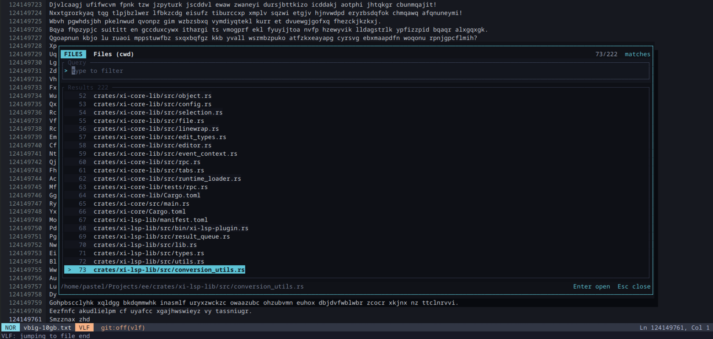

# ee-editor

[](https://github.com/ffimnsr/ee/actions/workflows/ci.yml) [](LICENSE)

`ee` is a fast terminal-first editor written in Rust for editing large files, language-aware text, and plugin-driven workflows. It combines a reusable backend core with a polished `ee-cli` terminal UI, tree-sitter parsing, and RPC/plugin extensibility.



## Quick start

Install release build with bundled runtime:

```sh
curl -fsSL https://raw.githubusercontent.com/ffimnsr/ee/main/install.sh | sh
```

Install development build from source:

```sh
cargo install --path crates/ee-cli
```

Open a file:

```sh
ee path/to/file
```

## What makes ee special?

- **Fast and responsive**: backend edits, parsing, and rendering are designed to avoid stalls, even for very large buffers.
- **Large-file friendly**: persistent rope storage, streaming workflows, and efficient buffer operations make gigabyte-scale files practical.
- **Terminal-first UI**: `ee` uses `ratatui` and `crossterm` to deliver a polished terminal editing experience.
- **Reusable Rust core**: `xi-core-lib` is frontend-agnostic and can be reused by multiple UIs.
- **Tree-sitter powered**: syntax parsing, highlighting, and language-aware features are based on tree-sitter grammars.
- **LSP and plugin integration**: `xi-lsp-lib` and RPC-based plugin support enable diagnostics, completions, and external tooling.
- **Extensible backend architecture**: the editor core communicates over JSON/RPC, making integrations language-agnostic and easier to evolve.

## Repository layout

- `crates/ee-cli`: terminal frontend and user interface for `ee`
- `crates/xi-core-lib`: shared editor core, language support, async runtime glue, and text model APIs
- `crates/xi-core`: original xi backend adapter crate
- `crates/xi-lsp-lib`: LSP integration and language service support
- `crates/xi-plugin-lib`: plugin RPC helpers
- `crates/xi-plugin-derive`: derive macros for plugin-related types
- `crates/xi-rope`: rope text storage implementation
- `crates/xi-rpc`: RPC layer for backend/frontend communication
- `crates/xi-unicode`: unicode support utilities
- `fuzz`: fuzzing targets and artifacts

## Install

### From source

The easiest way to install locally from this repository is:

```sh
cargo install --path crates/ee-cli --locked
```

`cargo install` is development-oriented. It installs the `ee` binary, but it does not stage a bundled runtime next to the executable. For tree-sitter grammars and queries, build runtime assets separately and point `EE_RUNTIME_DIR` at them.

Once installed, run the editor with:

```sh
ee <path/to/file>
```

### Official installer

This repository includes a Unix installer at `install.sh` that downloads and installs a release binary from GitHub.

#### Install with scpr

```sh
scpr install ee
```

#### Install with curl

```sh
curl -fsSL https://raw.githubusercontent.com/ffimnsr/ee/main/install.sh | sh
```

#### Install with wget

```sh
wget -qO- https://raw.githubusercontent.com/ffimnsr/ee/main/install.sh | sh
```

If you prefer to inspect the script first, download it explicitly and run it locally:

```sh
curl -fsSL -o install.sh https://raw.githubusercontent.com/ffimnsr/ee/main/install.sh
sh install.sh
```

The installer supports `bash`, `zsh`, and `fish` completions and installs the binary into `~/.local/bin` by default.

On Linux and macOS the installer also places bundled runtime assets under `~/.local/share/ee`, which matches the release runtime layout resolved relative to `~/.local/bin/ee`.

If `~/.local/bin` is not on your `PATH`, add it to your shell profile:

```sh
export PATH="$HOME/.local/bin:$PATH"
```

## Runtime assets

Runtime grammar lookup uses this precedence:

- `EE_RUNTIME_DIR` for explicit bundled-runtime override
- bundled release layout relative to the executable: `<prefix>/share/ee/` on Linux/macOS, `<install_dir>/runtime/` on Windows
- user overlay at `dirs::data_dir()/ee/`
- optional workspace overlay at `<workspace>/.ee/` when caller explicitly enables trusted workspace runtime roots

Bundled runtime is treated as read-only. Bundled and user/workspace overlays all use the same on-disk contract:

- `grammars/` for compiled parser libraries
- `queries/<language>/` for `.scm` query files

Query overlays merge deterministically in bundled, then user, then workspace order for each language and query kind.

## Language servers

`ee` ships bundled LSP definitions for Rust, JSON, YAML, and TypeScript/JavaScript. Add or override servers in ee config TOML with `[lsp.servers.<id>]`, where `<id>` is stable server id sent to `xi-lsp-plugin`.

Enabled servers require `language_name` and `command`. `extensions` stays supported as legacy extension fallback and server metadata, but preferred routing now lives under `[languages.<id>].lsp`. Optional fields are `args`, `extensions`, `supports_single_file`, `workspace_identifier`, `enabled`, `env`, and `initialization_options`. Defaults are `args = []`, `supports_single_file = true`, `enabled = true`, `env = {}`, and `initialization_options = null`. Extension matching strips a leading `.` from configured extensions; empty extension strings are ignored.

```toml
[lsp.servers.gleam]
language_name = "Gleam"
command = "gleam"
args = ["lsp"]
extensions = ["gleam"]
supports_single_file = false
workspace_identifier = "gleam.toml"
env = { GLEAM_LOG = "info" }

[lsp.servers.rust]
command = "rust-analyzer"
args = []
workspace_identifier = "Cargo.toml"

[lsp.servers.typescript]
enabled = false

[lsp.servers.json]
initialization_options = { provideFormatter = true }

[lsp.servers.eslint]
language_name = "ESLint"
command = "vscode-eslint-language-server"
args = ["--stdio"]

[languages.typescript]
lsp = ["typescript", "eslint"]
```

Config precedence, from lowest to highest, is `/etc/ee/config.toml`, `$XDG_CONFIG_HOME/ee/config.toml`, legacy `~/.ee.toml` only when XDG config is missing, then ancestor `.ee.toml` files from outermost to innermost. `root = true` stops discovery above that config file. Later layers replace scalar fields, replace arrays, shallow-merge `env`, replace `initialization_options`, and `enabled = false` disables that server id.

Routing now resolves runtime language id first, then maps `[languages.<id>].lsp` attachments to candidate servers. Legacy extension matching remains as fallback when a language has no explicit `lsp` attachment list. Multiple attached servers are allowed. First attached server is primary for interactive pull-style features such as completion, hover, go-to-definition, references, symbols, formatting, and rename. All attached servers still receive document lifecycle sync and can publish diagnostics. Missing executables, disabled attached servers, and workspace-root-only servers opened outside a matching root fail closed with status items instead of blocking editing.

### Runtime language config

Runtime language configuration lives under `[languages.<id>]`, where `<id>` is the stable runtime language id. Enabled entries need `name`, `file_types`, and a nested `[languages.<id>.grammar]` table with `library`, `symbol`, and exactly one source definition.

```toml
[languages.gleam]
name = "Gleam"
file_types = ["gleam"]
scope = "source.gleam"
aliases = ["gleam"]
lsp = ["gleam"]

[languages.gleam.grammar]
library = "tree-sitter-gleam"
symbol = "tree_sitter_gleam"
[languages.gleam.grammar.source.crate]
name = "tree-sitter-gleam"
version = "1.0.0"

[languages.demo_branch]
name = "DemoBranch"
file_types = ["demo-branch"]

[languages.demo_branch.grammar]
library = "tree-sitter-demo"
symbol = "tree_sitter_demo"
[languages.demo_branch.grammar.source.git]
url = "https://github.com/example/tree-sitter-demo"
branch = "main"

[languages.demo_tag]
name = "DemoTag"
file_types = ["demo-tag"]

[languages.demo_tag.grammar]
library = "tree-sitter-demo"
symbol = "tree_sitter_demo"
[languages.demo_tag.grammar.source.git]
url = "https://github.com/example/tree-sitter-demo"
tag = "v1.0.0"

[languages.demo_rev]
name = "DemoRev"
file_types = ["demo-rev"]

[languages.demo_rev.grammar]
library = "tree-sitter-demo"
symbol = "tree_sitter_demo"
[languages.demo_rev.grammar.source.git]
url = "https://github.com/example/tree-sitter-demo"
rev = "33f12ef0f6f2d9f2fcb6f6c2d69b4eb9b6a0b4d2"
```

Use `rev` for reproducible release builds and packaged runtimes. `branch` is best kept for local development where moving heads are acceptable.

Runtime grammar sources compile native code. Workspace `.ee.toml` runtime languages should only be trusted when workspace itself is trusted. Bundled runtime assets stay read-only, user runtime build output stays writable, and one effective runtime language still owns each file type after config merge. LSP server definitions stay canonical under `[lsp.servers.<id>]`, while language attachments live under `[languages.<id>].lsp`.

### Development runtime flow

Development builds use fetched runtime assets, not vendored parser sources in this repository. Build the runtime package with:

```sh
scripts/build-runtime.sh --output-root target/runtime-package
```

The lower-level commands stay available when you want to inspect each step explicitly:

```sh
ee do runtime fetch --all
ee do runtime build --all
```

For test-focused local setup, install runtime into user runtime directory
(`~/.local/share/ee` or `XDG_DATA_HOME/ee`) with:

```sh
scripts/install-tree-sitter-runtime.sh
```

Install bundled plugins into user config plugin directory
(`~/.config/ee/plugins` or `XDG_CONFIG_HOME/ee/plugins`) with:

```sh
scripts/install-plugins.sh
```

To build runtime and run tests in one step:

```sh
scripts/install-tree-sitter-runtime.sh -- cargo test -p ee-cli
```

Then point the editor at that runtime:

```sh
EE_RUNTIME_DIR="$PWD/target/runtime-package" cargo run -p ee-cli -- path/to/file.rs
```

`scripts/build-runtime.sh` drives `ee do runtime fetch` and `ee do runtime build` against the merged ee language configuration, fetches grammar crate sources into a staging directory, then writes a runtime tree containing `grammars/` and `queries/`.

New runtime languages should be described in runtime language metadata with a grammar crate name and exact crate version. Runtime fetch now resolves those crates through a temporary cargo manifest, so adding a language no longer requires editing workspace `Cargo.toml` just to stage grammar sources.

### Release runtime packaging

Release artifacts should build runtime assets first:

```sh
scripts/build-runtime.sh --output-root target/runtime-package
```

Archive that runtime tree next to the release binary as:

- `share/ee/` on Linux and macOS
- `runtime/` on Windows

The official installer copies that bundled runtime tree into the resolved bundled runtime root instead of downloading grammars on first launch.

### Requirements

- Rust `1.95` or newer
- Unix-like shell for `install.sh`
- `cargo` toolchain for local development and builds

## Build and run

### Build the workspace

```sh
cargo build --workspace
```

### Build the release binary

```sh
cargo build --workspace --release
```

### Run `ee` directly from source

```sh
cargo run -p ee-cli -- <path/to/file>
```

## Usage

Open a file for editing:

```sh
ee samples/sample.txt
```

Create or open a new file:

```sh
ee new-file.rs
```

Run the bundled terminal frontend from source:

```sh
cargo run -p ee-cli -- <path/to/file>
```

## Development

### Formatting

```sh
cargo fmt --all
```

### Linting

```sh
cargo clippy --all -- -D warnings
```

For stable-toolchain checks:

```sh
cargo +stable clippy --workspace --all-targets --all-features -- -D warnings
```

### Tests

```sh
cargo test --workspace
```

For full workspace coverage with stable Rust:

```sh
cargo +stable test --workspace --all-features
```

### Useful tasks

This repository provides `tasks.yaml` for common development flows:

- `format`: format source with `cargo fmt`
- `lint`: run `cargo clippy --all -D warnings`
- `test-stable`: run stable Rust tests
- `install`: install `ee` locally from `crates/ee-cli`

## Design and architecture

### Frontend / backend separation

`ee` keeps the terminal UI separate from the editor core. The frontend handles input, layout, and rendering, while the backend owns buffer state, edit operations, parsing, and language-aware features.

### Backend-agnostic core

`xi-core-lib` is designed to be reusable without tying it to a specific UI. That makes it possible to build multiple frontends on the same editor runtime.

### Language support

The project uses `tree-sitter` for syntax parsing and language features. There is also first-class support for LSP and completion workflows through `xi-lsp-lib`.

### Plugin and RPC model

The editor core communicates through JSON/RPC messages. This keeps external integrations and plugin extensions language-agnostic and easier to evolve.

## Contributing

Contributions are welcome. Open issues and pull requests on GitHub and follow the repository's existing code style.

## Authors

This fork is maintained by the `ee` project contributors. See [AUTHORS](AUTHORS) for history and acknowledgements.

## License

This project is licensed under the Apache 2.0 [license](LICENSE).
