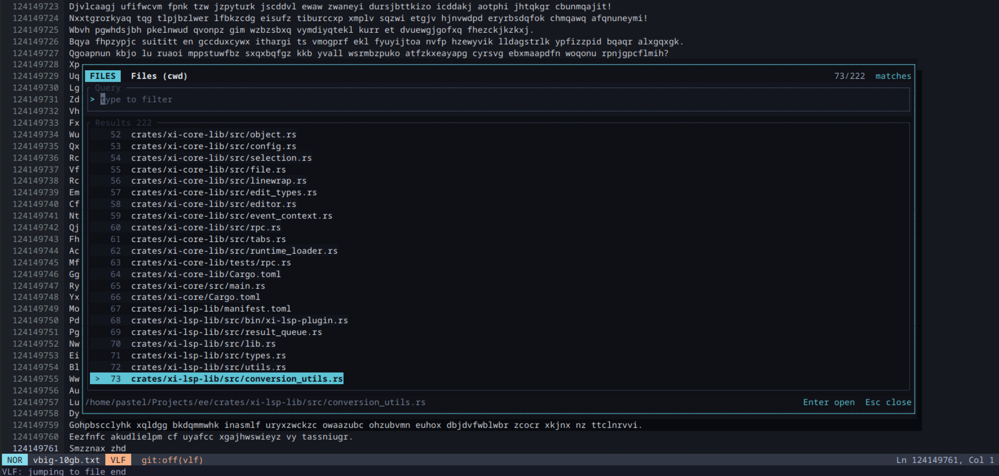

# ee-editor

[](https://github.com/ffimnsr/ee/actions/workflows/ci.yml) [](LICENSE)

`ee` is a fast terminal-first editor written in Rust for editing large files, language-aware text, and plugin-driven workflows. It combines a reusable backend core with a polished `ee-cli` terminal UI, tree-sitter parsing, and RPC/plugin extensibility.



## Quick start

Install release build with bundled runtime:

```sh
curl -fsSL https://raw.githubusercontent.com/ffimnsr/ee/main/install.sh | sh
```

Install development build from source:

```sh
cargo install --path crates/ee-cli
```

Open a file:

```sh
ee path/to/file
```

## What makes ee special?

- **Fast and responsive**: backend edits, parsing, and rendering are designed to avoid stalls, even for very large buffers.
- **Large-file friendly**: persistent rope storage, streaming workflows, and efficient buffer operations make gigabyte-scale files practical.
- **Terminal-first UI**: `ee` uses `ratatui` and `crossterm` to deliver a polished terminal editing experience.
- **Reusable Rust core**: `xi-core-lib` is frontend-agnostic and can be reused by multiple UIs.
- **Tree-sitter powered**: syntax parsing, highlighting, and language-aware features are based on tree-sitter grammars.
- **LSP and plugin integration**: `xi-lsp-lib` and RPC-based plugin support enable diagnostics, completions, and external tooling.
- **Extensible backend architecture**: the editor core communicates over JSON/RPC, making integrations language-agnostic and easier to evolve.

## Repository layout

- `crates/ee-cli`: terminal frontend and user interface for `ee`
- `crates/xi-core-lib`: shared editor core, language support, async runtime glue, and text model APIs
- `crates/xi-core`: original xi backend adapter crate
- `crates/xi-lsp-lib`: LSP integration and language service support
- `crates/xi-plugin-lib`: plugin RPC helpers
- `crates/xi-plugin-derive`: derive macros for plugin-related types
- `crates/xi-rope`: rope text storage implementation
- `crates/xi-rpc`: RPC layer for backend/frontend communication
- `crates/xi-unicode`: unicode support utilities
- `fuzz`: fuzzing targets and artifacts

## Install

### From source

The easiest way to install locally from this repository is:

```sh
cargo install --path crates/ee-cli --locked
```

`cargo install` is development-oriented. It installs the `ee` binary, but it does not stage a bundled runtime next to the executable. For tree-sitter grammars and queries, build runtime assets separately and point `EE_RUNTIME_DIR` at them.

Once installed, run the editor with:

```sh
ee <path/to/file>
```

### Official installer

This repository includes a Unix installer at `install.sh` that downloads and installs a release binary from GitHub.

Installer also installs bundled tree-sitter runtime assets into XDG data dir and bundled plugins into XDG config plugin dir by default.

#### Install with scpr

```sh
scpr install ee
```

#### Install with curl

```sh
curl -fsSL https://raw.githubusercontent.com/ffimnsr/ee/main/install.sh | sh
```

#### Install with wget

```sh
wget -qO- https://raw.githubusercontent.com/ffimnsr/ee/main/install.sh | sh
```

If you prefer to inspect the script first, download it explicitly and run it locally:

```sh
curl -fsSL -o install.sh https://raw.githubusercontent.com/ffimnsr/ee/main/install.sh
sh install.sh
```

Default install targets:

- binary: `~/.local/bin/ee`
- tree-sitter runtime: `~/.local/share/ee`
- bundled plugins: `~/.config/ee/plugins`

Override paths with `--bin-dir`, `--runtime-dir`, and `--plugin-dir`.

Installer and `mk install` include OpenRouter ACP agent by default. It does nothing until configured with an OpenRouter API key. Skip it from release installation with:

```sh
sh install.sh --without-openrouter-agent
```

The installer supports `bash`, `zsh`, and `fish` completions and installs the binary into `~/.local/bin` by default.

On Linux and macOS the installer also places bundled runtime assets under `~/.local/share/ee`, which matches the release runtime layout resolved relative to `~/.local/bin/ee`.

If `~/.local/bin` is not on your `PATH`, add it to your shell profile:

```sh
export PATH="$HOME/.local/bin:$PATH"
```

## Runtime assets

Runtime grammar lookup uses this precedence:

- `EE_RUNTIME_DIR` for explicit bundled-runtime override
- bundled release layout relative to the executable: `<prefix>/share/ee/` on Linux/macOS, `<install_dir>/runtime/` on Windows
- user overlay at `dirs::data_dir()/ee/`
- optional workspace overlay at `<workspace>/.ee/` when caller explicitly enables trusted workspace runtime roots

Bundled runtime is treated as read-only. Bundled and user/workspace overlays all use the same on-disk contract:

- `grammars/` for compiled parser libraries
- `queries/<language>/` for `.scm` query files
- bundled `indents.scm` assets currently ship for `rust`, `json`, and `python`

Query overlays merge deterministically in bundled, then user, then workspace order for each language and query kind.

## Language servers

`ee` ships bundled LSP definitions for Rust, JSON, YAML, and TypeScript/JavaScript. Add or override servers in ee config TOML with `[lsp.servers.<id>]`, where `<id>` is stable server id sent to `xi-lsp-plugin`.

Enabled servers require `language_name` and `command`. `extensions` stays supported as legacy extension fallback and server metadata, but preferred routing now lives under `[languages.<id>].lsp`. Optional fields are `args`, `extensions`, `supports_single_file`, `workspace_identifier`, `enabled`, `env`, and `initialization_options`. Defaults are `args = []`, `supports_single_file = true`, `enabled = true`, `env = {}`, and `initialization_options = null`. Extension matching strips a leading `.` from configured extensions; empty extension strings are ignored.

```toml
[lsp.servers.gleam]
language_name = "Gleam"
command = "gleam"
args = ["lsp"]
extensions = ["gleam"]
supports_single_file = false
workspace_identifier = "gleam.toml"
env = { GLEAM_LOG = "info" }

[lsp.servers.rust]
command = "rust-analyzer"
args = ["--stdio"]
workspace_identifier = "Cargo.toml"

[lsp.servers.typescript]
enabled = false

[lsp.servers.dockerfile]
command = "docker-langserver"
args = ["--stdio"]
filenames = ["Dockerfile", "Containerfile"]

[lsp.servers.json]
initialization_options = { provideFormatter = true }

[lsp.servers.eslint]
language_name = "ESLint"
command = "vscode-eslint-language-server"
args = ["--stdio"]

[languages.typescript]
lsp = ["typescript", "eslint"]
```

Config precedence, from lowest to highest, is `/etc/ee/config.toml`, `$XDG_CONFIG_HOME/ee/config.toml`, legacy `~/.ee.toml` only when XDG config is missing, then ancestor `.ee.toml` files from outermost to innermost. `root = true` stops discovery above that config file. Later layers replace scalar fields, replace arrays, shallow-merge `env`, replace `initialization_options`, and `enabled = false` disables that server id.

### Agents mode

Agents mode is an optional ACP v1 agent chat plus MCP integration. It is disabled at compile time and runtime by default: the `agents` cargo feature must be enabled at build time, and `agents.enabled = true` must be set in config. Agent and MCP subprocesses start lazily only after the mode is enabled and the agents pane opens or an agents command runs. Agent file writes route through existing buffer/edit/save semantics, and agent terminal executions and file writes require an approval path before execution.

ACP v1 wire types come from the official [`agent-client-protocol`](https://crates.io/crates/agent-client-protocol) SDK, re-exported through `crates/ee-agent-protocol` (the only crate allowed to own ACP wire structs). `ee-agent-protocol` adds strict v1-only version negotiation, absolute-path and 1-based-line validation, session-update ordering checks, unknown-capability capture for diagnostics, and a typed method registry; unsupported protocol versions, relative paths, and unknown elicitation modes fail closed with JSON-RPC `invalid params` errors.

Agent subprocesses are defined under `[agents.servers.<id>]`; `command` is required, `args`, `env`, and `cwd` are optional. MCP servers are shared configuration under `[mcp.servers.<id>]` with a required `transport` of `"stdio"` (requires `command`) or `"streamable_http"` (requires an `http(s)` `url`; optional `headers` and `timeout_ms`, default 30 000). Server ids must be non-empty and unique across `agents.servers` and `mcp.servers`.

```toml
[agents]
enabled = true
default_agent = "helper"

[agents.servers.helper]
command = "ee-helper"
args = ["serve"]

[mcp.servers.filesystem]
transport = "stdio"
command = "npx"
args = ["-y", "@modelcontextprotocol/server-filesystem"]

[mcp.servers.remote]
transport = "streamable_http"
url = "https://example.com/mcp"
timeout_ms = 5000
```

Agents ex commands are lowercase snake_case only: `:agents`, `:agents_close`, `:agents_stop`, `:agents_new`, and `:agents_clear`. CamelCase aliases are rejected. In focused Agents composer, exact `/new` starts and focuses a fresh chat thread; exact `/quit` closes pane while keeping its sessions running. Slash commands with arguments remain normal agent prompts.

#### ee MCP proxy contract

The editor proxy uses stable `ee_` tool names. Call `ee_tools_manifest` with no arguments first; its versioned, session-cacheable response lists only tools current host supports. Manifest is normative tool reference: each entry includes `inputSchema` (every argument, type, and required field), schema version, `read`/`write`/`execute` side-effect class, approval requirement, transport availability (`stdio` and/or ACP-native `acp`), required host capabilities, output cap kind and maximum, redaction rules, typed error classes, deprecation/replacement metadata, and minimal schema-valid arguments. Existing names and schemas stay compatible. Incompatible argument or result changes require a new tool name.

Read tools do not require approval. Write and execute tools require editor approval unless an existing bounded trust rule permits exact operation. Tool calls with malformed arguments fail as MCP invalid-parameter errors; disabled or unsupported known tools return a tool-level `isError` result. Manifest error classes are `invalid_arguments`, `unsupported_tool`, `permission_denied`, `backend_failure`, `output_truncated`, plus `stale_revision` for writes and `terminal_not_owned` for terminal operations. Paths must be absolute and inside editor workspace roots. Results are bounded; callers must inspect truncation metadata where provided. Secret-like environment values and keys, credentials, and sensitive diagnostics are rejected or redacted. Keep arguments small and explicit: when an operation needs nested modes or many optional fields, add smaller focused tools instead of extending one complex schema.

`stdio` intentionally omits ACP-only terminal lifecycle tools (`ee_terminal_output`, `ee_terminal_output_since`, `ee_terminal_wait`, `ee_terminal_wait_long`, `ee_terminal_kill`, and `ee_terminal_release`) instead of advertising unsupported behavior. `ee_terminal_create` remains available on both routes. Hosts with fewer capabilities must similarly omit unavailable tools from discovery while continuing to expose `ee_tools_manifest`.

`crates/ee-mcp/tests/fixtures/ee_tools_manifest-v1.json` is generated directly from manifest data and snapshots tool names, schemas, and policy metadata. `cargo test --quiet -p ee-mcp manifest_snapshot_matches_versioned_contract` detects accidental compatibility changes. Intentionally regenerate only after version review with `cargo test --quiet -p ee-mcp regenerate_manifest_snapshot -- --ignored`. `fuzz/` also contains `ee_mcp_proxy_arguments`, which feeds arbitrary JSON objects into production argument-size validation; run it with `cargo fuzz run ee_mcp_proxy_arguments`.

#### Replayable LLM evaluation

`crates/ee-agent-orchestrator/tests/fixtures/replay/v1/tasks.json` contains hermetic, versioned task fixtures for bug fixes, features, refactors, reviews, investigations, multi-file work, stale/dirty/conflicted edits, interruption/recovery, approval/capability denials, and adversarial repository content. Fixtures never materialize a workspace, call a provider, use real time, read user-home state, execute validation commands, or access network. They run only scripted model/tool fakes.

Each replay records a stable SHA-256 trace id, redacted relative workspace snapshot, JSONL event trace, task/validation/recovery/policy score, diff and approval counts, model/tool calls, deterministic latency, tokens, integer micro-USD cost estimate, and counter-only role delegation effectiveness (`useful_findings`, duplicate work, write conflicts, latency, cost). Candidate labels include provider/model, prompt, tool-manifest/schema, policy, routing, and `stdio` or ACP-native MCP transport so evidence cannot mix configurations.

#### Privacy-safe harness observability

`TelemetryRecorder` provides separate `telemetry-v1` records for local harness diagnostics. It is disabled by default and memory-only: no network delivery, automatic file persistence, raw prompts, workspace paths/content, session/task ids, tool arguments/output, terminal output, error text, or environment values are accepted by its API. Hosts explicitly call `start_turn`, `record_started`, `record_finished`, and `finish_turn` at model-routing/model-call, tool, approval, retry, recovery, and validation boundaries. Events contain only sequence, monotonic elapsed milliseconds, stage, host-local opaque operation id, safe outcome, optional typed tool failure, and bounded sanitized declared tool name.

`TelemetryAttribution` snapshots validated opaque provider, model, prompt, manifest, schema, policy, routing, and transport version labels at turn start. Secret-like, empty, overlong, or non-identifier labels fail closed before retention. `TelemetrySummary` carries only quality score, latency, approval/tool/model counts, integer micro-USD cost, and a typed failure counter map: `invalid_input`, `policy_denial`, `stale_state`, `timeout`, `transport_failure`, `unavailable_capability`, or `internal_error`. Cancellation remains an outcome, not a failure bucket.

`TelemetryConfig` is user control: `enabled`, `max_turns`, `max_events_per_turn`, and `max_bytes_per_turn`. Completed turns use deterministic bounded retention; event or byte overflow marks record `truncated` with `dropped_events`; `clear` removes all active and retained local records. `export_jsonl` returns stable redacted JSONL only—caller chooses whether and where to write it. Failed turns may link a versioned lowercase-snake-case `ReplayFixtureCandidate` and host-redacted opaque `RedactedEvidenceRef`s. Success records reject those links. This makes evidence useful for replay triage without claiming reproduction proof or retaining sensitive payloads.

#### Subagent delegation quality controls

Root agent owns delegation selection, final synthesis, and final write decisions. Call `DelegationPreflight::assess` before child dispatch with root-provided expected information gain, token and integer-cost budget, depth, work key, and intended absolute write scope. It rejects low-value work, duplicate work keys, recursion or aggregate-budget excess, definite conflict risk, relative scopes, and overlapping accepted scopes. Existing runtime policy still enforces delegate depth, per-turn subagent budget, cancellation propagation, scoped tools, and deterministic quarantine; preflight never bypasses those controls.

Parallel children require independent work keys and one accepted write owner per file or module. Root must route all actual edits through existing approval and write-transaction gates; a child report is evidence, not permission to mutate workspace state.

Verifier-capable roles return `SubagentReport` schema version `1`: each `SubagentFinding` has a key, claim, `observed` or `inference` kind, cited file/tool evidence, confidence, rejected alternatives, and recommended next action. `SubagentReportVerifier` rejects empty or uncited claims and citations absent from observed child execution; only its `VerifiedSubagentReport` proof can enter `reconcile_reports`. Reconciliation groups findings by key; contradictory claims keep `RootSynthesis.ready_for_plan` false until root adds explicit cited `RootResolution`. No automatic winner exists.

`DelegationEffectiveness` stays counter-only and role-keyed. Evaluation/replay score output records useful findings, duplicate work, conflicts, latency, and estimated cost. `quality_impact(role)` reports `improved`, `neutral`, or `degraded` from those facts; it never stores prompts, paths, summaries, or hidden reasoning.

`baseline.json` defines required-fixture regression thresholds. CI runs `cargo test --quiet -p ee-agent-orchestrator --features test-utils evaluation`; failures name fixture, score delta, and redacted trace reference. Before changing a default model, prompt, route, tool, or policy behavior, run this gate, review every failing fixture, then deliberately update versioned fixture/baseline evidence. No default change may rely on subjective comparison alone.

#### Evidence-gated completion and validation

`ee-agent-orchestrator` never treats model text or reflection prose as proof that work completed. `FinalResponse.completion` is one of `verified`, `partially_verified`, `blocked`, or `unverified`, derived only from `CompletionEvidence` and selected `ValidationRecord`s. A `verified` changed turn requires matching current-revision evidence IDs for changed-file inventory, post-write diagnostics, final diff review, and one selected passing validation result. Final summaries cite these IDs in `evidence:`; `can_finish` is false for every other state.

`ValidationRecord` returns structured evidence: `evidence_id`, command, tool, outcome, exit status, elapsed milliseconds, affected tests, diagnostics delta, output-truncation flag, skip reason, revision, selection, denial status, detail, and source task. Validation that cannot run remains `partially_verified` with an exact blocker and safe next step. Failed, stale, or denied evidence is `blocked`; missing evidence is `unverified`.

`ValidationPlanner::plan_with_context` combines changed files, graph-resolved changed symbols, workspace validation configuration, declared project tasks, and registered tools. Unknown tools never enter a plan. Keep validation tools narrow: if arguments need many modes, nested objects, or optional branches, split operation into smaller focused tools instead of growing one complex schema.

#### Targeted validation and command intelligence

Workspace-declared validation commands use schema version `1`: `DeclaredValidationCommand { task, metadata }`. `task` supplies registered `tool_name`, display `command`, JSON-object `arguments`, optional `file_extensions`, and optional resolved `symbols`. `metadata` requires stable `command_id` and declares `scope` (`targeted` or `workspace`), prerequisite command ids, approval class (`policy` or `host`), and bounded stable `test_ids`. Empty ids, self-prerequisites, unavailable tools, and `host` metadata paired with a tool lacking `host_approval` never enter a plan.

Planner selects targeted file/symbol checks first. Workspace checks become `after_focused_pass` escalations whenever a focused command exists; they run only after every earlier focused command and every explicit prerequisite passes. Missing or failed prerequisites create bounded skipped evidence with `missing_dependency`; no broad command is dispatched. This makes escalation explicit, ordered, and bounded rather than a speculative full-suite fallback.

`ValidationResult` is structured command evidence: stable command id, outcome, typed failure (`command_failed`, `timeout`, `cancelled`, `policy_denied`, `missing_dependency`, `unavailable_environment`, or `invalid_arguments`), exit status, elapsed milliseconds, test ids, diagnostics delta, attempt count, retry reasons, escalation, redaction flag, output-truncation flag, and bounded output. Output is secret-redacted then capped at `8192` bytes. Only explicitly classified transient tool failures (`backend` and `timeout`) retry, under `RetryPolicy.max_retries`; policy denial, malformed arguments, and cancellation never retry.

Every generated validation command executes through `ToolExecutor`; schema validation, workspace/shell scope rules, policy allow-lists, host approval, cancellation, timeout, budget, and output caps therefore remain mandatory. Do not generate shell strings or bypass executor policy from validation metadata.

#### Auditable write transactions

Hosts record a `WriteTransaction` for each mutation sequence and pass it through `StrategicInput.write_transaction`. Transaction evidence is serializable and includes transaction id, absolute changed paths, expected source revisions, preview summaries, approval outcome, per-path apply result, post-write path and workspace revisions, diagnostics delta, final diff, selected `ValidationRecord`, terminal state, and rollback safety evidence.

`WriteTransaction` enforces fixed order: `read revision → preview → approval → apply → diagnostics → final diff → selected validation → terminal state`. Every stage after apply must match post-write workspace revision. Stale, duplicate, missing, ambiguous, or conflicting revisions block sequence with structured error code such as `stale_revision`, `ambiguous_revision`, `partial_apply`, or `diagnostic_regression`. Dirty user or unknown-owned buffers fail closed before apply; no automatic repair or replay runs after conflict, denial, partial apply, interruption, or diagnostics regression.

Only blocked or unverified transactions may request rollback. `prepare_rollback` requires explicit approval, exact current post-write workspace revision, proof no later user edits exist, and every applied path marked agent-owned. `record_rollback` rechecks revision before recording completion. When a transaction accompanies strategic completion, it can only constrain a pre-existing verified completion claim; incomplete, blocked, interrupted, or rolled-back transaction evidence changes that claim to `unverified` or `blocked` and adds `transaction:<id>` provenance.

#### Task-aware context planning

`ContextPlanner` accepts only bounded host-supplied `ContextCandidate`s. It selects fresh project instructions, active selections, dirty buffers, diagnostics, git diffs, symbol neighbors, tests, related config/docs, memory, terminal output, and external-tool output in that fixed priority order. It never performs broad repository reads. `ContextPlannerConfig` caps item count, excerpt characters, and estimated tokens; omitted candidates identify `stale_revision`, `token_budget`, `item_limit`, or `duplicate`, so caller can explicitly drill down later.

Every `PlannedContextItem` records source, source-local canonical id, freshness revision, source-specific trust class, estimated token cost, selection reason, and truncation reason. `ContextTrustClass` keeps `repository_content`, `terminal_output`, `external_tool_output`, and `user_provided` separate. Only `system_policy` becomes a system message; repository, terminal, and external data always enter model requests as `ToolOutputUntrusted`, where injection guard labels and delimiters apply.

`ContextPlanCache` only returns plans with identical task id, session, policy, workspace, buffer, diagnostics, graph, checkout, and candidate revisions. Call `invalidate(ContextInvalidation::Write | BufferRevision | DiagnosticsRevision | GraphRevision | CheckoutRevision | PolicyChanged | SessionEnded)` after matching host state changes. No stale plan may survive a write, editor revision, diagnostics refresh, graph refresh, checkout, policy change, or session end.

#### Workspace agent trust

Enable ee proxy when agent supports MCP:

```toml
[mcp.proxy]
enabled = true
```

Then, from workspace root, grant every built-in safe profile:

```sh
ee do agent trust grant
```

Or select built-in profiles explicitly:

```sh
ee do agent trust grant --profile mcp_safe_read
ee do agent trust grant --profile terminal_readonly
ee do agent trust revoke --profile terminal_readonly
```

Repeat `--profile` to select several. Profile names are application-owned; config cannot add commands or tools. Trust writes only host-local state under `$XDG_STATE_HOME/ee/trust/`, bound to canonical workspace identity. It never reads authority from `.ee.toml`, global config, or agent-provided files.

Grant covers `ee_*` safe-read tools on both stdio and ACP routes, exact workspace-root Git invocations (`git status`, `git diff`, `git log`, `git show`, and `git branch --show-current`), plus direct `pwd`, `ls`, `ls -a`, `ls -l`, `ls -la`, `ls -al`, and `cat <one workspace file>`. `cat` accepts only one relative regular file outside protected paths; flags, multiple paths, secret-like files, external paths, and symlink escapes still prompt. Shell wrappers, other Git arguments, writes, and VCS mutations still prompt. Agents should prefer `ee_list_directory`, `ee_read_text_file`, and `ee_search_*` when available.

#### LLM session compaction (`/compact`)

Agents advertise slash commands through ACP `available_commands_update`; the pane lists them (name plus description) and Tab cycles them, using each command's advertised input hint as the draft placeholder. `ee-openrouter-agent` and `ee-agent-orchestrator` advertise `/compact`, and the client sends it as a normal `session/prompt` — there is no client-side compaction special case, and the provider owns every history or memory change.

`/compact` asks the configured model for a continuation summary and shrinks long session context:

- **`ee-openrouter-agent` (simple provider)** replaces its stored history with the summary plus a recent tail. Tunables (all also `--<flag>` CLI options):
  - `OPENROUTER_COMPACT_MIN_MESSAGES` (default `16`) — stored messages below this make `/compact` a no-op without a model call.
  - `OPENROUTER_COMPACT_RETAINED_TAIL` (default `8`) — messages kept verbatim at the tail after compaction; tool-call/tool-result pairs stay consistent.
  - `OPENROUTER_COMPACT_MAX_INPUT_BYTES` (default `65536`) — serialized history bound for the compaction request; oldest messages drop first.
- **`ee-agent-orchestrator`** runs deterministic memory compaction first (duplicate merging and low-value decay), builds a provenance-rich context from the task graph, memory, validation facts, and budget, then asks the model (no tools) and stores the summary as `summary:session` memory. Its knobs live under the orchestrator `compaction` config (`max_input_bytes`, default `65536`).

Security limits: secret-like values are redacted from compaction requests and status text; protected memory (`decision:`, `constraint:`, `validation:` keys) is never deleted by LLM output; compaction input is byte-bounded; compaction calls never expose tools; and the per-turn timeout and cancellation still apply.

Routing now resolves runtime language id first, then maps `[languages.<id>].lsp` attachments to candidate servers. Exact `filenames` matches such as `Dockerfile`, `Containerfile`, `Justfile`, or `CMakeLists.txt` win before extension fallback. Legacy extension matching remains as fallback when a language has no explicit `lsp` attachment list. Multiple attached servers are allowed. First attached server is primary for interactive pull-style features such as completion, hover, go-to-definition, references, symbols, formatting, and rename. All attached servers still receive document lifecycle sync and can publish diagnostics. Missing executables, disabled attached servers, and workspace-root-only servers opened outside a matching root fail closed with status items instead of blocking editing.

### Runtime language config

Runtime language configuration lives under `[languages.<id>]`, where `<id>` is the stable runtime language id. Enabled entries need `name`, `file_types`, and a nested `[languages.<id>.grammar]` table with `library`, `symbol`, and exactly one source definition.

```toml
[languages.gleam]
name = "Gleam"
file_types = ["gleam"]
scope = "source.gleam"
aliases = ["gleam"]
lsp = ["gleam"]

[languages.gleam.grammar]
library = "tree-sitter-gleam"
symbol = "tree_sitter_gleam"
[languages.gleam.grammar.source.crate]
name = "tree-sitter-gleam"
version = "1.0.0"

[languages.demo_branch]
name = "DemoBranch"
file_types = ["demo-branch"]

[languages.demo_branch.grammar]
library = "tree-sitter-demo"
symbol = "tree_sitter_demo"
[languages.demo_branch.grammar.source.git]
url = "https://github.com/example/tree-sitter-demo"
branch = "main"

[languages.demo_tag]
name = "DemoTag"
file_types = ["demo-tag"]

[languages.demo_tag.grammar]
library = "tree-sitter-demo"
symbol = "tree_sitter_demo"
[languages.demo_tag.grammar.source.git]
url = "https://github.com/example/tree-sitter-demo"
tag = "v1.0.0"

[languages.demo_rev]
name = "DemoRev"
file_types = ["demo-rev"]

[languages.demo_rev.grammar]
library = "tree-sitter-demo"
symbol = "tree_sitter_demo"
[languages.demo_rev.grammar.source.git]
url = "https://github.com/example/tree-sitter-demo"
rev = "33f12ef0f6f2d9f2fcb6f6c2d69b4eb9b6a0b4d2"
```

Use `rev` for reproducible release builds and packaged runtimes. `branch` is best kept for local development where moving heads are acceptable.

Runtime grammar sources compile native code. Workspace `.ee.toml` runtime languages should only be trusted when workspace itself is trusted. Bundled runtime assets stay read-only, user runtime build output stays writable, and one effective runtime language still owns each file type after config merge. LSP server definitions stay canonical under `[lsp.servers.<id>]`, while language attachments live under `[languages.<id>].lsp`.

### Development runtime flow

Development builds use fetched runtime assets, not vendored parser sources in this repository. Build the runtime package with:

```sh
scripts/build-runtime.sh --output-root target/runtime-package
```

The lower-level commands stay available when you want to inspect each step explicitly:

```sh
ee do runtime fetch --all
ee do runtime build --all
```

For test-focused local setup, install runtime into user runtime directory
(`~/.local/share/ee` or `XDG_DATA_HOME/ee`) with:

```sh
scripts/install-tree-sitter-runtime.sh
```

Install bundled plugins into user config plugin directory
(`~/.config/ee/plugins` or `XDG_CONFIG_HOME/ee/plugins`) with:

```sh
scripts/install-plugins.sh
```

To build runtime and run tests in one step:

```sh
scripts/install-tree-sitter-runtime.sh -- cargo test -p ee-cli
```

Then point the editor at that runtime:

```sh
EE_RUNTIME_DIR="$PWD/target/runtime-package" cargo run -p ee-cli -- path/to/file.rs
```

`scripts/build-runtime.sh` drives `ee do runtime fetch` and `ee do runtime build` against the merged ee language configuration, fetches grammar crate sources into a staging directory, then writes a runtime tree containing `grammars/` and `queries/`.

That packaged query tree includes upstream standard queries plus ee-owned bundled runtime queries such as `runtime/queries/rust/indents.scm`, `runtime/queries/json/indents.scm`, and `runtime/queries/python/indents.scm`. `scripts/install-tree-sitter-runtime.sh` installs same built query assets because it delegates to `scripts/build-runtime.sh`.

New runtime languages should be described in runtime language metadata with a grammar crate name and exact crate version. Runtime fetch now resolves those crates through a temporary cargo manifest, so adding a language no longer requires editing workspace `Cargo.toml` just to stage grammar sources.

### Release runtime packaging

Release artifacts should build runtime assets first:

```sh
scripts/build-runtime.sh --output-root target/runtime-package
```

Archive that runtime tree next to the release binary as:

- `share/ee/` on Linux and macOS
- `runtime/` on Windows

The official installer copies that bundled runtime tree into the resolved bundled runtime root instead of downloading grammars on first launch.

### Requirements

- Rust `1.95` or newer
- Unix-like shell for `install.sh`
- `cargo` toolchain for local development and builds

## Build and run

### Build the workspace

```sh
cargo build --workspace
```

### Build the release binary

```sh
cargo build --workspace --release
```

### Run `ee` directly from source

```sh
cargo run -p ee-cli -- <path/to/file>
```

## Usage

Open a file for editing:

```sh
ee samples/sample.txt
```

Create or open a new file:

```sh
ee new-file.rs
```

Run the bundled terminal frontend from source:

```sh
cargo run -p ee-cli -- <path/to/file>
```

## Development

### Formatting

```sh
cargo fmt --all
```

### Linting

```sh
cargo clippy --all -- -D warnings
```

For stable-toolchain checks:

```sh
cargo +stable clippy --workspace --all-targets --all-features -- -D warnings
```

### Tests

```sh
cargo test --workspace
```

For full workspace coverage with stable Rust:

```sh
cargo +stable test --workspace --all-features
```

### Useful tasks

This repository provides `tasks.yaml` for common development flows:

- `format`: format source with `cargo fmt`
- `lint`: run `cargo clippy --all -D warnings`
- `test-stable`: run stable Rust tests
- `install`: install `ee` locally from `crates/ee-cli`

## Design and architecture

### Frontend / backend separation

`ee` keeps the terminal UI separate from the editor core. The frontend handles input, layout, and rendering, while the backend owns buffer state, edit operations, parsing, and language-aware features.

### Backend-agnostic core

`xi-core-lib` is designed to be reusable without tying it to a specific UI. That makes it possible to build multiple frontends on the same editor runtime.

### Language support

The project uses `tree-sitter` for syntax parsing and language features. There is also first-class support for LSP and completion workflows through `xi-lsp-lib`.

### Plugin and RPC model

The editor core communicates through JSON/RPC messages. This keeps external integrations and plugin extensions language-agnostic and easier to evolve.

## Contributing

Contributions are welcome. Open issues and pull requests on GitHub and follow the repository's existing code style.

## Authors

This fork is maintained by the `ee` project contributors. See [AUTHORS](AUTHORS) for history and acknowledgements.

## License

This project is licensed under the Apache 2.0 [license](LICENSE).

