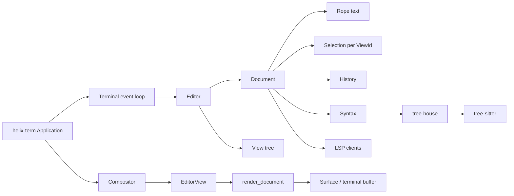
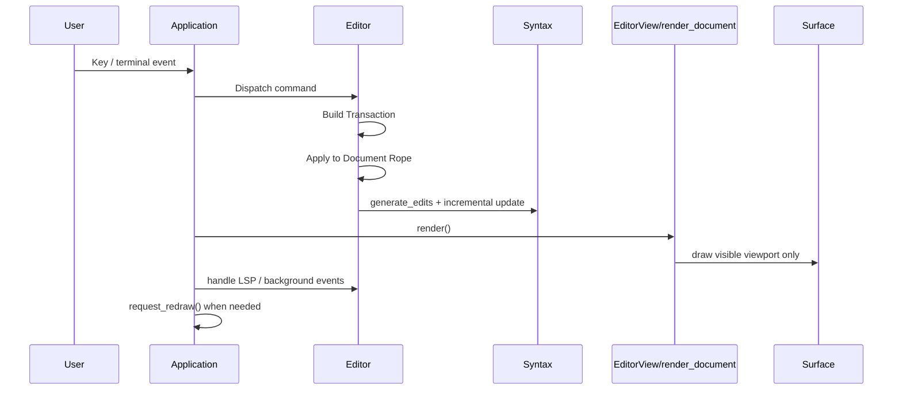

# Helix Editor Repository Analysis

## Executive Summary

This report analyzes the urlhelix-editor/helix repositoryhttps://github.com/helix-editor/helix with a focus on large-file behavior, core architecture, and how to reproduce the most important design choices in Rust. The high-confidence architectural picture is clear: Helix is a multi-crate workspace where `helix-core` provides the functional editing primitives, `helix-view` owns editor/document/view state, `helix-term` runs the async terminal frontend and event loop, `helix-lsp` handles language servers, and `helix-event` provides synchronous hooks plus debounced async hooks. The central document representation is a `Rope`-backed `Document` that also carries selections, history, diagnostics, syntax state, encoding metadata, and LSP attachments. citeturn13view0turn49search0turn50search2turn50search1

For large files, Helix’s strongest decisions are architectural rather than heuristic. It uses Ropey, whose `Rope` offers mostly `O(log N)` edits/queries, cheap `O(1)` clones, and good behavior for huge in-memory texts; it loads text through a streaming decoder into a `RopeBuilder`; it saves from a cloned rope snapshot asynchronously; it incrementally updates syntax trees through edit deltas; and it renders only visible views/visible viewport regions rather than the whole document every frame. These choices are exactly the ones you would want if your goal is “large text, many edits, bounded UI latency.” citeturn33search1turn53search0turn30view1turn50search0turn51search0turn51search1

The main limitation is that Helix is not an out-of-core editor. Ropey explicitly documents itself as an in-memory structure, and Helix’s `Document` stores the full rope in memory. There is also no explicit “large-file mode” or size threshold in the reviewed sources. Historical issue reports show that tree-sitter-related latency on large or pathological files has been a real problem; Helix’s current mitigations appear to be incremental parsing, a 500 ms parse timeout, and `tree-house`’s bounded match limit, which intentionally trades some highlight completeness for better performance. That is a pragmatic design, but it is not the same thing as a dedicated massive-file subsystem. citeturn33search4turn10search4turn30view1turn36search1turn36search6

If you want to replicate Helix’s core in Rust, the clearest path is: use a rope-based text buffer first, model edits as invertible transactions, keep selections/view offsets outside the rope itself, integrate incremental parsing behind a `Syntax` façade, and separate the editor state model from the frontend/render loop. If your target is “very large files with modest language tooling,” Helix’s design is an excellent template. If your target is “multi-gigabyte files, out-of-core access, or highly pathological grammars,” you should consider a piece-tree or mmap-backed variant instead of following Helix literally. citeturn13view0turn31view1turn31view3turn35search9turn35search10turn35search6

## Repository Snapshot and Architectural Spine

Helix’s own architecture document describes the workspace in roughly four layers: `helix-core` for functional editing primitives; `helix-view` for editor/document/view state; `helix-lsp` for language server communication; `helix-term` for the terminal frontend; and `helix-event` for cross-cutting events and debounced async hooks. The same document states the intended division of responsibility succinctly: `Document` ties together the rope, selections, syntax, history, and language-server-related state; `View` is a split/window onto a document; `Editor` is the global state holder for open documents, splits, configuration, and language servers; and the terminal layer owns the top-level event loop. For release-anchored line references below, I use the 25.07.1 source snapshot, which is the release associated with commit `a05c151`. citeturn13view0turn4search0turn14search4

The current `Editor` type in `helix-view/src/editor.rs` still matches that architectural description: it owns the split tree, a `BTreeMap<DocumentId, Document>`, and document/view lifecycle. The current `View` type in `helix-view/src/view.rs` stores a `ViewPosition` of `{ anchor, horizontal_offset, vertical_offset }`, which is the key detail behind viewport-local rendering and scrolling. `View::inner_area`, `inner_height`, and `screen_coords_at_pos` make explicit that Helix converts between document positions and screen positions relative to the visible viewport rather than treating the whole document as renderable all at once. citeturn50search2turn50search0

At the document level, `helix-view/src/document.rs` is the real center of gravity. In the 25.07.1 source snapshot, `Document` stores `text: Rope`, per-view selections, view-local data, path and encoding information, syntax state, language configuration, pending changes, an undo `History`, diagnostics, language-server clients, and diff state. The same file shows `Document::text()` returning `&Rope`, `Document::selection()` returning a per-view `Selection`, `Document::text_format()` preparing wrap/layout settings, and revision bookkeeping via `last_saved_revision` and `history.current_revision()`. This is a deliberately fat document model: Helix does not try to keep text, parse state, or UI-adjacent document state in separate ownership islands. citeturn49search0turn52search0

That design has an important consequence for replication: Helix is not “rope plus plugins.” It is “rope plus a stateful document object that owns semantics, history, and per-view projections.” That is why a faithful reimplementation should not start with a minimal `Buffer { rope }`; it should start with a `Document` type that can own text, transactions, syntax, revisions, diagnostics, and view-local selections together. citeturn13view0turn49search0turn50search0

## Large-File Handling

Helix’s large-file story begins with text storage. The architecture document says the main buffer data structure is a `Rope`, and `helix-core` re-exports Ropey. Ropey’s own documentation says nearly all edits and queries are worst-case `O(log N)`, cloning is `O(1)` and shares backing data, and the library is designed to remain efficient on huge texts, including pathological one-line files. Ropey also states plainly that it is in-memory, which is an important boundary on Helix’s scalability story: Helix is built to handle large files *in memory*, not to page them lazily from disk. citeturn13view0turn33search1turn33search4

That choice strongly favors Helix over gap-buffer designs for large, non-local editing. GNU Emacs’s buffer-gap documentation explains the classic downside of a gap buffer: after editing in one part of a large buffer, the first edit far away may require moving the gap and cause a noticeable delay. Crowley’s piece-table paper, by contrast, emphasizes immutable original/add buffers and piece descriptors, which make undo easier and reduce large rewrites. Helix did not choose either of those families; it chose a rope because it wanted persistent snapshots, cheap cloning, structurally cheap non-local edits, and straightforward sharing between asynchronous tasks. That matches both Helix’s architecture doc and Ropey’s cloning semantics. citeturn35search6turn35search9turn35search10turn13view0turn33search1

The document load path is more careful than “read file into a giant string.” `helix-view/src/document.rs` defines an 8 KiB buffer constant for encoding/decoding ropes and a `from_reader()` implementation that reads bytes into a fixed buffer, auto-detects encoding with BOM detection and `chardetng`, decodes incrementally with `encoding_rs`, and appends decoded UTF-8 chunks into a `RopeBuilder`. That means large-file opening is streaming and incremental during decode/build, even though the final result is still a fully resident in-memory rope. citeturn49search0turn53search0

The save path is similarly large-file-aware. `Document::save_impl()` clones the current rope and path into a future explicitly “so that we asynchronously save the current state without blocking any further edits,” then writes the encoded text and notifies LSP servers on successful save. The 24.07 release notes also mention that Helix moved to temporary-file writes. In other words, Helix decouples the mutable on-screen document from the save operation by snapshotting the rope, then performing the write off the hot editing path. Ropey’s cheap shared-data cloning makes this design practical. citeturn52search0turn11search3turn33search1

For fine-grained I/O, Helix also exposes rope chunks as a reader. `helix-core/src/rope_reader.rs` defines `RopeReader<'a>` around Ropey’s chunk iterator and implements `io::Read` by draining the current chunk and then advancing chunk-by-chunk. That is a small file, but it is a very telling one: Helix systematically prefers chunked, rope-native traversal instead of flattening the document first. If you replicate Helix, this is a pattern worth keeping. citeturn32view1turn32view2

Incremental syntax is the next major pillar. In current `helix-core/src/syntax.rs`, `Syntax` is a thin wrapper over `tree_house::Syntax`; it constructs syntax state with a 500 ms parse timeout and updates it by generating edit deltas from a `ChangeSet` and passing those edits into `self.inner.update(...)`. The same file shows lazy loading and compilation of highlight, injection, and locals queries. The official Tree-sitter project describes incremental parsing as being fast enough to run on every keystroke, and Helix leans into that model rather than reparsing the whole file after each edit. citeturn30view1turn31view0turn30view4turn33search2

Helix does, however, put explicit performance guardrails on syntax work. The `Syntax` wrapper uses `const PARSE_TIMEOUT: Duration = Duration::from_millis(500)`, and the `tree-house` docs expose a `TREE_SITTER_MATCH_LIMIT` constant described as a deliberate trade-off: it avoids performance problems on medium-to-large files but may lose valid captures. The 25.07 changelog says Helix switched to the `tree-house` crate for syntax highlighting and related tree-sitter features, and the `tree-house` repository describes the highlighter as a rewrite done for simplification and bug-fixing. Read together, that suggests a strategy of improving correctness while still acknowledging bounded work as necessary in large documents. citeturn30view1turn36search1turn36search0turn36search6

The cautionary evidence is the issue tracker. Issue #3072 reports multi-second editing latency on large files when tree-sitter is active, including a roughly 50K-line C++ file and even much smaller Markdown files with pathological list structures. I did not find an explicit “disable tree-sitter above N bytes” rule in the reviewed sources, so the pragmatic reading is this: Helix’s current design is *large-file conscious*, but not a full-blown large-file mode with hard cutoffs or alternate algorithms for huge inputs. citeturn10search4turn30view1turn36search1

Rendering also contains important large-file optimizations. In `helix-term/src/ui/editor.rs`, `EditorView::render_view()` computes the inner viewport, prepares annotations and decorations, then calls `render_document(...)`; the same file’s top-level `render()` iterates only through the currently visible views in the editor tree. `helix-term/src/ui/document.rs` then builds a `TextRenderer` with the viewport rectangle and current scroll offsets and renders from `doc.text().slice(..)` using view-relative anchor/offset information. `helix-view/src/view.rs` shows the complementary projection math from document positions into visible screen coordinates and back. The net effect is that Helix renders the document *through a viewport transform*, not by materializing screen state for the whole file. citeturn51search1turn51search0turn50search0

Viewport culling is visible even in the rendering entry points. In the current UI code, `render_view()` derives the inner area and passes `view_offset` into `render_document()`, while `render_document()` initializes `TextRenderer` with the viewport and a `{ row, col }` offset. Separately, `View::inner_height()` and `screen_coords_at_pos()` operate strictly relative to the clipped inner area. This is exactly the right arrangement for large files: the buffer remains global, but layout, syntax presentation, and coordinate translation are bounded by the visible window. citeturn51search1turn51search0turn50search0

Undo/redo is also rope-friendly. The architecture doc describes text edits as OT-like `Transaction`s over a rope; `helix-core/src/transaction.rs` shows that a `Transaction` holds a `ChangeSet` plus an optional `Selection`, can be applied to a `Rope`, and can be inverted to produce an undo. In `helix-view/src/document.rs`, committed revisions are pushed into `History` via `history.commit_revision(&transaction, &old_state)`, and “modified” is defined in terms of current revision versus last-saved revision plus pending changes. For large files, this is preferable to snapshotting the entire buffer on every edit: the buffer is persistent-ish at the rope level, and the history travels as structured changes. citeturn13view0turn31view1turn31view3turn52search0

One notable limitation sits right inside the transaction layer. `helix-core/src/transaction.rs` documents a mapping/composition idea that resembles a basis for operational transformation, but the exposed `map(self, _other)` function is still `unimplemented!()`. That does not hurt ordinary single-user editing, but it is an important constraint if you were hoping to treat Helix’s transaction engine as a near-finished collaborative editing core. citeturn31view4

The following table summarizes the relevant data-structure trade-offs. The rope row is grounded in Ropey’s documented behavior; the gap-buffer row in GNU Emacs’s documentation; and the piece-table row in Crowley’s classic paper. The time-complexity cells are the standard operational abstractions these sources support. citeturn33search1turn35search6turn35search9turn35search10

| Data structure | Insert/delete near cursor | Insert/delete far away | Memory model | Undo friendliness | Suitability for very large in-memory files | Suitability for out-of-core files |
|---|---:|---:|---|---|---|---|
| Rope | Typically `O(log N)` | Typically `O(log N)` | Tree nodes, shared clones, moderate overhead | Good when combined with transactions/snapshots | High | Moderate to low without extra paging layer |
| Gap buffer | Often `O(1)` amortized at the gap | Can degrade toward `O(N)` when moving the gap far | Very compact contiguous array plus gap | Fair, but usually needs extra history machinery | Moderate for local editing, weaker for scattered edits | Low |
| Piece table / piece tree | Good for non-destructive edits; depends on index structure | Good with indexed piece descriptors / trees | Original buffer + append-only add buffer + descriptor structure | Excellent | High | Better than gap buffer, often preferred when scaling piece indexing carefully |

For Helix specifically, the rope decision is the right one. The editor already wants cheap snapshots for async saves, structural edits for undo/redo, and a text API that can serve both editing and rendering without flattening. A gap buffer would hurt multi-cursor and non-local editing, and a piece table would require significantly more bespoke indexing/query machinery to reach the same ergonomic API surface Helix already gets from Ropey. citeturn33search1turn13view0turn31view2turn32view1

## Architecture Diagrams

The component relationships below reflect the division of responsibilities documented in `docs/architecture.md` and echoed by the current `Editor`, `Document`, `View`, and terminal UI code. citeturn13view0turn49search0turn50search0turn51search1



The next diagram shows the buffer lifecycle Helix follows when opening, editing, re-highlighting, rendering, and saving a document. The key observation is that “buffer” means different things at different layers: the primary document buffer is a rope, while the rendering buffer is a viewport-sized terminal surface. citeturn53search0turn31view1turn30view1turn51search0turn51search1

```mermaid
flowchart TD
    A[Disk bytes] --> B[from_reader]
    B --> C[RopeBuilder]
    C --> D[Document { Rope, History, Syntax, selections, encoding }]
    D --> E[Transaction / ChangeSet]
    E --> F[Apply to Rope]
    F --> G[Syntax.update with incremental edits]
    D --> H[ViewPosition { anchor, horizontal_offset, vertical_offset }]
    H --> I[render_view]
    I --> J[render_document]
    J --> K[TextRenderer over visible viewport]
    K --> L[Surface / terminal cells]
    D --> M[save_impl clones Rope snapshot]
    M --> N[async encoded write]
    N --> O[LSP didSave]
```

The final diagram highlights the event/render loop. Helix multiplexes terminal input, signals, background-job callbacks, status messages, futures, and editor/LSP events in one async loop, then schedules redraws through the compositor/render pipeline. This is important for large-file editing because syntax and LSP activity can be noisy, and Helix explicitly coalesces some redraw pressure rather than rendering on every single message. citeturn37view3turn38view0turn38view1turn38view3turn39view2



## Replicating the Core in Rust

The best way to reproduce Helix’s strengths is not to copy files one-for-one, but to copy the *interfaces and invariants*. Use urlropeyhttps://docs.rs/ropey or a closely equivalent rope as the canonical text store, model edits as invertible transactions, keep viewport state outside the rope, and put all syntax/parsing behind a façade like Helix’s `Syntax`. For syntax work, use either urltree-househttps://docs.rs/tree-house/latest/tree_house/ if you want a Helix-like query/highlighting stack, or urltree-sitterhttps://github.com/tree-sitter/tree-sitter directly if you want lower-level control. For async orchestration, use urltokiohttps://docs.rs/tokio; for terminal rendering, a stack like urlratatuihttps://ratatui.rs plus urlcrosstermhttps://github.com/crossterm-rs/crossterm is the closest broadly available analogue to Helix’s terminal layer. citeturn33search1turn36search1turn33search2turn13view0turn37view3

A good replication plan is the following.

1. **Build a document model, not just a buffer.**  
   Start with a `Document` that owns the rope, per-view selections, syntax handle, history, encoding metadata, revision numbers, and optional diagnostics/LSP attachments. This mirrors Helix’s actual design and prevents the architecture from fragmenting later. citeturn49search0turn52search0

2. **Represent edits as transactions over immutable-ish text.**  
   Helix’s `Transaction` and `ChangeSet` layer is the backbone for editing, selection mapping, undo generation, and syntax delta generation. Reproduce that before worrying about fancy commands. citeturn31view1turn31view2turn31view3

3. **Stream file I/O into and out of the rope.**  
   Do not read giant files into a `String`. Follow Helix’s pattern: decode bytes incrementally into a `RopeBuilder`, and encode/write from rope chunks through a bounded buffer. citeturn53search0turn32view1

4. **Integrate syntax incrementally.**  
   Maintain a syntax object that accepts `InputEdit`-like deltas derived from text transactions. Put timeouts or match limits at the syntax/highlighter boundary rather than in the command code. citeturn30view1turn31view0turn36search1

5. **Keep view state separate from document state.**  
   Use a lightweight `ViewPosition` containing an anchor and scroll offsets, and derive visible coordinates relative to a clipped inner area. That gives you split windows and bounded rendering naturally. citeturn50search0turn51search0turn51search1

6. **Run one async event loop that multiplexes input, jobs, and editor events.**  
   The important property is not “Tokio specifically,” but “single coordination loop, many event sources, redraw coalescing.” Helix’s `tokio::select!` loop is a good pattern to emulate. citeturn37view3turn38view0turn38view3

Here is a minimal Helix-like document core in Rust. This is intentionally smaller than Helix, but it preserves the right responsibilities.

```rust
use ropey::Rope;
use std::collections::HashMap;

#[derive(Clone, Copy, Debug, Eq, PartialEq, Hash)]
pub struct ViewId(pub u64);

#[derive(Clone, Debug)]
pub struct Range {
    pub anchor: usize,
    pub head: usize,
}

#[derive(Clone, Debug)]
pub struct Selection {
    pub ranges: Vec<Range>,
    pub primary: usize,
}

#[derive(Clone, Debug, Default)]
pub struct ViewPosition {
    pub anchor: usize,
    pub horizontal_offset: usize,
    pub vertical_offset: usize,
}

#[derive(Debug)]
pub struct Document {
    pub text: Rope,
    pub selections: HashMap<ViewId, Selection>,
    pub views: HashMap<ViewId, ViewPosition>,
    pub syntax: Option<SyntaxState>,
    pub history: HistoryState,
    pub revision: usize,
    pub encoding_label: &'static str,
}

#[derive(Debug, Default)]
pub struct HistoryState {
    undo: Vec<Transaction>,
    redo: Vec<Transaction>,
}

#[derive(Debug, Clone)]
pub struct Transaction {
    pub changes: Vec<Change>,
    pub next_selection: Option<Selection>,
}

#[derive(Debug, Clone)]
pub struct Change {
    pub start_char: usize,
    pub end_char: usize,
    pub insert_text: String,
}

#[derive(Debug)]
pub struct SyntaxState {
    // wrap tree-sitter/tree-house state here
}
```

The edit application path should be transaction-first and syntax-aware. The most important invariant is: apply rope changes, derive syntax edits from the *same* transaction, then commit the revision. citeturn31view1turn31view3turn30view1turn52search0

```rust
impl Document {
    pub fn apply_transaction(&mut self, tx: Transaction) {
        // Save inverse for undo before mutation.
        let inverse = invert_transaction(&self.text, &tx);

        // Apply text edits in reverse order of start position so char offsets remain valid.
        let mut changes = tx.changes.clone();
        changes.sort_by_key(|c| std::cmp::Reverse(c.start_char));

        let old_text = self.text.clone();

        for ch in &changes {
            self.text.remove(ch.start_char..ch.end_char);
            self.text.insert(ch.start_char, &ch.insert_text);
        }

        if let Some(sel) = tx.next_selection.clone() {
            // caller is responsible for selection invariants
            // store under the active view, or map all selections if you support that
            if let Some((_, active_sel)) = self.selections.iter_mut().next() {
                *active_sel = sel;
            }
        }

        if let Some(syntax) = &mut self.syntax {
            let input_edits = generate_tree_sitter_edits(&old_text, &self.text, &tx);
            syntax.update(&old_text, &self.text, &input_edits);
        }

        self.history.undo.push(inverse);
        self.history.redo.clear();
        self.revision += 1;
    }
}
```

For incremental parsing, the Helix pattern is the right one: keep a syntax wrapper, accept the old text, the new text, and a list of generated edits, and let the parser/highlighter update internally. The exact API differs between plain Tree-sitter and `tree-house`, but the architecture should look like this. citeturn30view1turn31view0turn33search2turn36search1

```rust
pub struct SyntaxEngine {
    // parser / tree / highlighter state
}

pub struct InputEditLike {
    pub start_byte: usize,
    pub old_end_byte: usize,
    pub new_end_byte: usize,
    pub start_position: (usize, usize),   // row, column
    pub old_end_position: (usize, usize),
    pub new_end_position: (usize, usize),
}

impl SyntaxEngine {
    pub fn update(
        &mut self,
        old_text: &Rope,
        new_text: &Rope,
        edits: &[InputEditLike],
    ) {
        // 1. Apply edits to existing parse tree
        // 2. Reparse incrementally against new_text
        // 3. Refresh highlight/query layers lazily for the visible region
        // 4. Enforce timeout / match-limit policies at this boundary
        let _ = (old_text, new_text, edits);
    }
}
```

For the event loop, Helix’s `tokio::select!` shape is worth copying almost directly. The engineering point is to keep UI input, background jobs, and editor/LSP events in the same coordinator, but coalesce redraws. citeturn37view3turn38view0turn38view3

```rust
use tokio::select;
use tokio::sync::mpsc;

pub async fn event_loop(
    mut input_rx: mpsc::Receiver<InputEvent>,
    mut editor_rx: mpsc::Receiver<EditorEvent>,
    mut job_rx: mpsc::Receiver<JobResult>,
    editor: &mut EditorCore,
) {
    render(editor).await;

    loop {
        select! {
            Some(input) = input_rx.recv() => {
                editor.handle_input(input);
                if editor.needs_redraw() {
                    render(editor).await;
                }
            }
            Some(result) = job_rx.recv() => {
                editor.handle_job_result(result);
                if editor.needs_redraw() {
                    render(editor).await;
                }
            }
            Some(evt) = editor_rx.recv() => {
                editor.handle_editor_event(evt);
                // often better to mark dirty and coalesce
                if editor.should_flush_redraw() {
                    render(editor).await;
                }
            }
            else => break,
        }
    }
}
```

If you want to reproduce Helix’s large-file behavior specifically, there are three non-negotiable implementation details. First, never flatten the full rope on the hot path. Second, keep syntax work incremental and bounded. Third, render from `(document rope, view offset, viewport rect)` rather than from a pre-expanded full-screen model. Those are the design choices doing most of the work. citeturn32view1turn30view1turn51search0turn50search0

## Standout Features and Best Implementations

**The rope-centered `Document` model is unusually coherent.**  
In `helix-view/src/document.rs` the document owns rope text, selections, syntax, history, diagnostics, language-server clients, encoding metadata, and revision state in one place. Many editors scatter those concerns across multiple managers; Helix’s version is easier to reason about because every edit-relevant concern is document-local. File references: `helix-view/src/document.rs:141-183`, `1944-1957`, `1715-1777` in the 25.07.1 source snapshot. citeturn49search0turn52search0

**Transactions are the right abstraction boundary.**  
`helix-core/src/transaction.rs` is not just an undo helper. It is the contract between commands, text mutation, selection updates, history, and syntax delta generation. The fact that `Transaction` can be applied and inverted, and that higher-level helpers like `change_by_selection()` exist, makes multi-cursor editing much simpler than direct rope mutation would. File references: `helix-core/src/transaction.rs:3075-3144`, `3345-3459`. citeturn31view1turn31view2turn31view3

**The syntax layer hides complexity without dumbing it down.**  
`helix-core/src/syntax.rs` is one of the best seams in the codebase. It wraps `tree-house`, compiles highlights/injections/locals lazily, applies incremental edits, and carries explicit parse timeout policy. This is a strong example of how to keep tree-sitter integration from bleeding through the whole editor. File references: `helix-core/src/syntax.rs:2342-2386`, `3102-3142`, `3424-3442`. citeturn30view1turn30view4turn31view0

**Viewport math lives with the `View`, not the renderer.**  
`helix-view/src/view.rs` stores scroll state as `ViewPosition`, exposes `inner_area()`, and converts between document positions and visible screen coordinates. That separation is one of the reasons Helix’s renderer stays bounded by the viewport rather than pulling full-document knowledge into every drawing path. File references: `helix-view/src/view.rs:121-125`, `192-201`, `402-430`, `545-567`. citeturn50search0

**The async top-level application loop is pragmatic and scalable.**  
`helix-term/src/application.rs` uses `tokio::select!` to multiplex terminal input, signals, callbacks, futures, status messages, and editor events. It then explicitly requests redraws for fast language-server traffic rather than eagerly rendering on each message. That is the sort of “small” decision that prevents the frontend from collapsing under noisy background activity. File references: `helix-term/src/application.rs:2735-2846`, `3347-3400`, `3536+`. citeturn37view3turn38view0turn38view1turn38view3

**Rendering is strongly pipeline-shaped.**  
In `helix-term/src/ui/editor.rs`, `render_view()` assembles decorations, cursor/diagnostic overlays, rulers, and syntax inputs, then delegates to `render_document()`. In `helix-term/src/ui/document.rs`, `render_document()` constructs a `TextRenderer` with viewport and offset state and hands off the actual text iteration. This is a good example of pushing policy preparation upward and keeping the lowest-level text renderer narrowly focused. File references: `helix-term/src/ui/editor.rs:77-197`, `1491-1524`; `helix-term/src/ui/document.rs:31-76`, `175-273`. citeturn51search1turn51search0

## Risks, Limitations, Alternatives

The biggest limitation is simple: Helix is optimized for large *in-memory* files, not arbitrarily large files. Ropey explicitly calls out that it is an in-memory structure, and Helix’s `Document` stores the full rope. If your target is multi-gigabyte logs, binary-adjacent inspection, or truly out-of-core editing, a literal Helix clone is the wrong baseline. You would want a paging layer, mmap-backed slices, or a piece-tree architecture designed around partial residency. citeturn33search4turn49search0

The second limitation is parser-induced latency. Helix clearly knows this is a risk: it uses incremental parsing, a 500 ms parse timeout, and a `TREE_SITTER_MATCH_LIMIT` that explicitly trades correctness for bounded work. But the historical issue tracker also shows that tree-sitter-heavy editing on large or pathological files has produced unacceptable lag in practice. I did not find an explicit large-file threshold or fallback mode in the reviewed sources, so if you need a hard guarantee for very large files, you should add one yourself. citeturn10search4turn30view1turn36search1

The third limitation is architectural scope. Helix’s transaction layer is excellent for single-user editing and undo/redo, but the unimplemented `ChangeSet::map()` means the OT-like surface is not a finished collaborative-editing engine. If collaboration is on your roadmap, treat Helix’s transaction system as inspiration, not as a drop-in foundation for CRDT/OT. citeturn31view4

There is also a product-footprint trade-off around grammars and syntax infrastructure. Independent of runtime edit speed, Helix’s issue tracker has noted that packaged grammars can be quite large on disk. That does not directly make normal editing slower, but it does matter for distribution size and cold-start ecosystem complexity. citeturn10search5turn36search0

If I were choosing alternatives by target, I would do the following. For a terminal editor that should feel like Helix and handle large source files well, I would stay close to Helix: rope, transactions, incremental parser, viewport renderer. For a simpler editor where edits are overwhelmingly local and implementation complexity matters most, a gap buffer remains viable. For extreme undo requirements, very large documents, and descriptor-tree indexing, a piece table or piece tree deserves serious consideration. Those trade-offs are exactly the ones the standard literature and editor practice point to. citeturn35search6turn35search9turn35search10turn33search1

The main open question I could not fully resolve from the reviewed sources is whether current `master` has added any hidden large-file heuristics beyond the explicit parse timeout, bounded query matching, and viewport-bounded rendering already visible in the architecture and release-aligned source snapshots. I did not see a documented byte-count threshold, syntax auto-disable rule, or separate giant-file execution path. citeturn13view0turn30view1turn36search1turn10search4

### Assumptions

I assumed “large files” meant anything from tens of megabytes up to the upper bound of what an in-memory rope editor can practically hold, because you did not specify a threshold. I assumed cross-platform terminal targets because you did not restrict the platform. I also assumed that release-aligned source references from 25.07.1 are acceptable for code-line discussion when paired with current architectural docs and issue/changelog material.