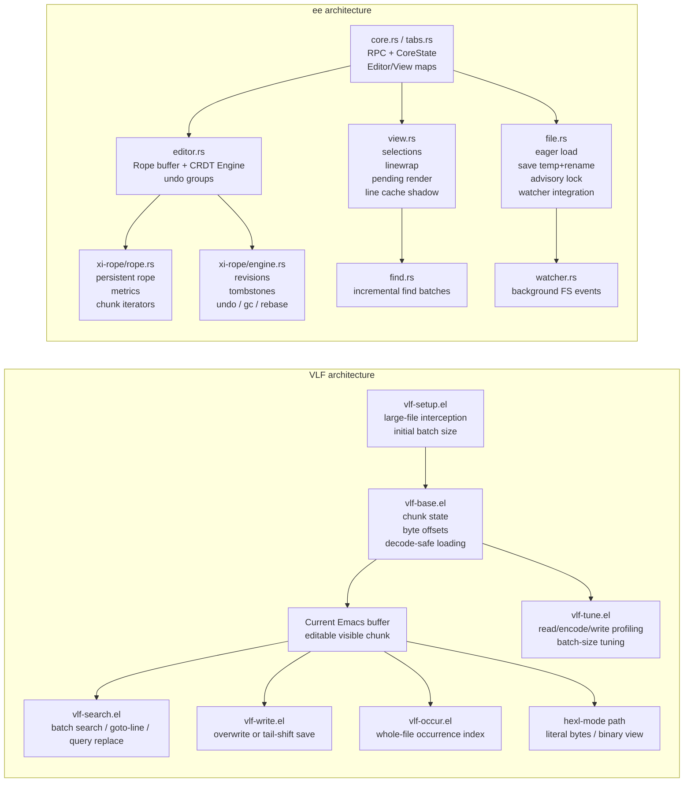
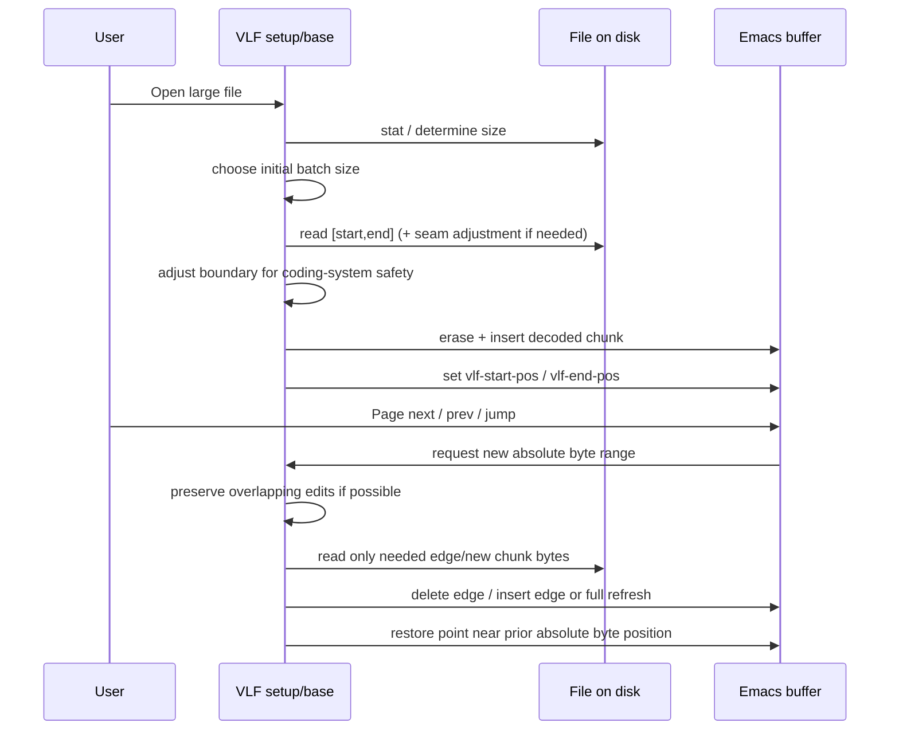
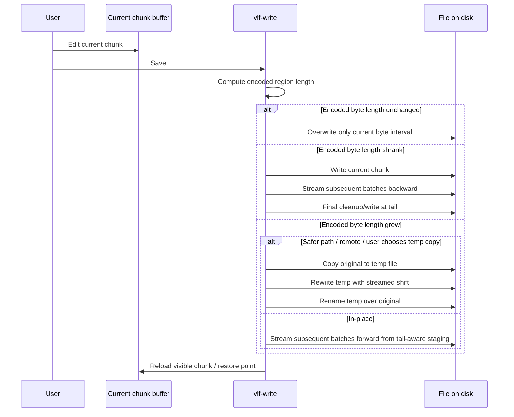
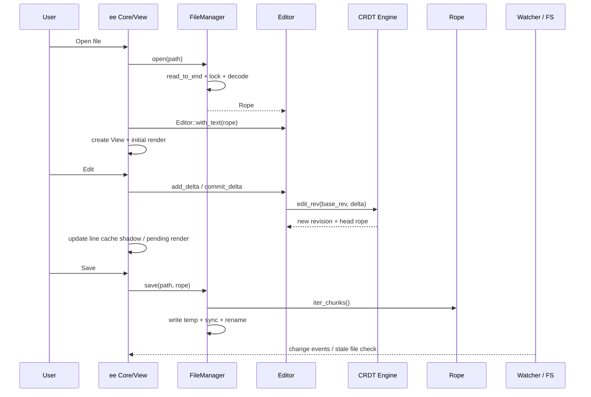

# Emacs VLF and ee

## Executive summary

The two codebases solve “large text editing” from opposite ends of the design space. urlVLFhttps://github.com/m00natic/vlfi is fundamentally a **byte-windowed viewport over a file**: it keeps only one chunk of the file in a normal Emacs buffer, tracks that chunk with absolute byte offsets, and reuses stock Emacs editing/search machinery on the current window. When a chunk boundary would cut through an encoded character, VLF adjusts the read window and recomputes byte/character boundaries before exposing text to the buffer. When saving a modified chunk whose encoded byte length changed, it reconciles the tail of the file by streaming bytes forward or backward in batches, optionally through a temporary copy. That yields excellent memory behavior for arbitrarily large files and makes binary/hex editing practical, but it also means many semantics are **local to the current chunk** and globally strong guarantees are limited. citeturn37search0turn22view0turn36search0turn32view6turn32view7turn34view4

By contrast, urleehttps://github.com/ffimnsr/ee is a **full-document editor core** descended from Xi. It eagerly opens a file by reading the entire file into memory, decoding it as UTF-8 or UTF-8-with-BOM, and storing it in a persistent rope. Edits flow through a CRDT-style revision engine with undo groups, revision IDs, tombstones, plugin-friendly rebasing, multiple views, incremental rendering, file watching, and advisory file locking. This gives much stronger editor semantics for whole-document undo/redo, concurrent plugin edits, and multi-view consistency, but memory scales with document size, and the current file layer is text-only rather than arbitrary-binary. citeturn45view0turn38view0turn38view1turn38view2turn21view0turn21view5turn40view0turn40view3turn41view0turn41view4

The practical conclusion is straightforward. If your target editor must open files that are much larger than available RAM, or must support binary inspection/editing, the **VLF model is the right base architecture**. If your target editor’s priority is rich whole-buffer semantics, incremental rendering, plugin concurrency, and predictable global undo, the **ee/Xi rope-plus-revision model is stronger**, but it is not an out-of-core design in its current file-loading path. A useful hybrid would borrow **VLF’s out-of-core windowing** at the storage layer and **ee’s revision/view/cache model** above it. citeturn37search0turn22view0turn36search0turn45view0turn38view1turn21view0turn44view1turn44view8

## Architecture

Assumption for the replication guidance below: the target editor platform and implementation language are unspecified, so the recommendations are language-agnostic unless explicitly tied to Emacs Lisp or Rust behavior.

At repository level, VLF is a relatively small extension organized around a few “primitive + feature” Lisp modules: opening/setup, chunk movement, tuning, search, save, occur, and ediff. ee is a workspace with a more classical editor-core decomposition: core state and RPC handling, buffer editor logic, file management, persistent rope + CRDT engine, view/rendering, and search/watcher subsystems. citeturn37search1turn22view0turn35view0turn19view0turn44view9turn21view0turn38view1turn41view0



The decisive architectural difference is **where state of truth lives**. In VLF, the file on disk remains the truth and the buffer is a movable working window over it. In ee, the in-memory rope and revision engine are the truth during editing, and disk persistence is a serialization step from that full in-memory model. citeturn22view0turn36search0turn38view1turn21view0turn40view0

### Key source files

For VLF, the most important primary-source passages are urlREADME and user-facing behavior overviewturn37search0, urlvlf-setup.elturn37search1, urlvlf-base.el passage on chunk movement and decode-boundary handlingturn22view0, urlvlf-write.el passage on overwrite vs tail shiftingturn36search0, urlvlf-search.el passage on batch search and query replaceturn34view4, urlvlf-tune.el passage on profiling and batch-size tuningturn32view4, and urlvlf-occur.el passage on whole-file occurrence indexingturn35view0. ee’s highest-value files are urlREADME.mdturn45view0, urlCargo.toml workspace membersturn19view0, urlcore.rs L34-L114https://github.com/ffimnsr/ee/blob/master/crates/xi-core-lib/src/core.rs#L34-L114, urleditor.rs L48-L76https://github.com/ffimnsr/ee/blob/master/crates/xi-core-lib/src/editor.rs#L48-L76, urleditor.rs L165-L337https://github.com/ffimnsr/ee/blob/master/crates/xi-core-lib/src/editor.rs#L165-L337, urlfile.rs L43-L338https://github.com/ffimnsr/ee/blob/master/crates/xi-core-lib/src/file.rs#L43-L338, urlrope.rs L34-L537https://github.com/ffimnsr/ee/blob/master/crates/xi-rope/src/rope.rs#L34-L537, and urlfind.rs L60-L323https://github.com/ffimnsr/ee/blob/master/crates/xi-core-lib/src/find.rs#L60-L323. citeturn37search0turn37search1turn22view0turn36search0turn34view4turn32view4turn35view0turn45view0turn19view0turn21view0turn38view1turn41view0turn44view7

### Feature and design comparison

| Aspect | VLF | ee |
|---|---|---|
| Primary abstraction | Sliding byte window over on-disk file | Full in-memory rope document |
| File open strategy | Read only current batch/chunk | Read entire file into memory |
| Memory scaling | Roughly O(batch size) for normal editing | Roughly O(file size) plus revision/cache overhead |
| Binary support | Yes, through hexl/literal-byte path | No; file layer expects UTF-8 or UTF-8+BOM |
| Undo model | Native buffer undo on current chunk, plus offset shifting while preserving overlapping edits | Global undo groups via CRDT engine |
| Save path | Same-size overwrite, otherwise stream tail-shift or temp-copy rewrite | Temp-file write from rope chunks, sync, rename |
| Concurrency | Essentially synchronous | Mutex-protected core, plugin revision flow, watcher thread |
| Search model | Chunk-by-chunk regex over mutable buffer window | Incremental rope search batches with cached occurrences |

This table is synthesized directly from VLF’s setup/base/write/search/tune modules and ee’s file/editor/rope/engine/view/find/watcher modules. citeturn37search1turn22view0turn36search0turn34view4turn32view4turn38view1turn21view0turn40view0turn41view0turn44view0turn44view7turn44view8

## Data flow and large-file mechanics

VLF starts from a default initial batch size of 1,000,000 bytes and can intercept large-file opening via advice around `abort-if-file-too-large`. Once active, it tracks the visible portion of the file with buffer-local absolute byte positions `vlf-start-pos` and `vlf-end-pos`, plus the total file size. Chunk movement goes through `vlf-move-to-chunk`, which either fully refreshes the buffer or, when possible, preserves overlapping edits by deleting/inserting only the changed edges of the current buffer window. The key subtlety is decode safety: VLF does not assume arbitrary byte boundaries are valid text boundaries, so `vlf-insert-file-contents` and `vlf-adjust-start` inspect nearby bytes, compare encoded lengths, and shift boundaries backward or forward to obtain a decodable region under the active Emacs coding system. citeturn37search1turn22view0turn32view6

ee’s open path is much simpler conceptually and much heavier operationally: `FileManager::open` rejects non-UTF-8 paths for RPC reasons, loads the file via `read_to_end`, guesses UTF-8 vs UTF-8-with-BOM, decodes the whole content into a rope, stores file metadata, and optionally starts watcher integration. From there, the editor works against the full document, while views map visible line ranges into rendered updates. Access into the document is efficient because the rope provides O(log n) edits and line/offset conversions, iterators over chunks, and mostly-borrowed line iteration, but this is still an eager full-document model rather than a paged one. citeturn38view0turn38view1turn38view2turn38view7turn41view0turn42view2turn45view0



That VLF flow is the core reason it scales to “very large files” in practice: open cost and steady-state memory depend mainly on chunk size, not document size. The trade-off is that the editor surface is effectively a **moving projection** of the file, so every feature that assumes a stable whole-buffer text model must be reinterpreted in terms of chunk movement and absolute byte positions. ee avoids that problem by paying the up-front load cost. citeturn37search0turn22view0turn38view1turn41view0

### Paging, memory, and buffer management

VLF’s memory profile is intentionally tight. Normal text viewing keeps only the current chunk in the Emacs buffer, plus small decode-adjustment slack at chunk edges, plus measurement vectors for auto-tuning. With `hexl-mode`, the visible representation expands because bytes are hexlified for display, and VLF explicitly dehexlifies/rehexlifies when moving or saving. The tuning system records bytes-per-second for decoded inserts, literal raw inserts, encoding, writes, hexlify, and dehexlify, and then adjusts `vlf-batch-size` toward a target load time of about one second, capped by `vlf-tune-max`, which itself is derived from RAM size and Emacs’ large-file threshold logic. This is a very pragmatic “measure this machine, on this file” optimization strategy. citeturn32view1turn32view2turn32view6turn32view7turn37search0

ee’s comparable optimization is structural rather than out-of-core. The rope uses persistent nodes with thread-safe reference counting and copy-on-write mutation, with leaves in the 511–1024 byte range; line, UTF-8, and UTF-16 metrics are computed over the tree; chunk iteration is non-allocating; and visible rendering is aggressively cached and incrementally invalidated through line-cache shadow and delayed/pending render scheduling. This is excellent for medium and large text documents that still fit in memory, but it is not a substitute for paging on truly enormous files. citeturn41view0turn41view4turn42view0turn42view1turn42view2turn44view1turn27view3

## Editing, saving, undo, and concurrency

VLF editing semantics are local-first. The current chunk is an ordinary editable Emacs buffer, so insertions/deletions happen exactly as they would in a normal buffer. The complexity appears when the visible byte window changes. `vlf-move-to-chunk-1` attempts to preserve as much in-chunk editing as possible by computing encoded byte lengths, deleting or inserting edge regions, realigning point by byte position, and shifting entries in `buffer-undo-list` when offsets move. If the requested move would invalidate too much state, or if the file changed on disk, VLF may prompt before discarding or refreshing. This is clever, but it also means undo is **not a whole-file structural history** in the ee sense; it is fundamentally the buffer undo history for the active window, with some offset rebasing when chunk slides stay compatible. citeturn22view0turn17view0

ee offers much stronger document-wide semantics. `Editor` stores the current rope plus a CRDT `Engine`, revision IDs, undo groups, and in-flight revision accounting. Edits enter via `add_delta`, are committed against a base revision, and can be undone/redone by toggling undo groups; the current implementation keeps a low `MAX_UNDOS` of 20 specifically to stress-test GC behavior during development. Plugin edits are not just “local buffer mutations”; they are revisioned deltas against the engine, can fail if based on unknown revisions, and are garbage-collected only when no plugin revisions remain in flight. That is a significantly more powerful editor core than VLF’s chunk-local mutable buffer approach. citeturn21view0turn21view1turn21view3turn21view5turn40view1turn40view2turn40view3turn40view4



VLF’s save path is the most distinctive part of the project. If the encoded byte length of the edited chunk is unchanged, VLF overwrites only that byte interval. If it changed, VLF computes `size-change` and then either shifts later file content backward or forward in batches. For safer behavior, especially on remote files or when the user opts out of in-place adjustment, it copies the whole file to a temporary file, performs the same streamed transformation there, and renames the temp file over the original. This is an *out-of-core patching algorithm*, not a whole-document rewrite. citeturn36search0turn33view2turn33view3

ee’s save path is easier to reason about but more memory-dependent because the document is already loaded. `FileManager::save` ultimately writes the rope to a temporary “.swp”-style path by iterating rope chunks, `sync_all`s the temp file, renames it over the destination, best-effort syncs the parent directory on Unix, and restores permissions. That is a robust persistence path. It also takes an advisory exclusive lock on open/save, marks externally changed files through file metadata/watcher logic, and refuses ordinary save when the tracked file has changed on disk. VLF, by comparison, uses Emacs visited-file modtime checks and prompts, but it does **not** implement the same explicit advisory-lock lifecycle in the code examined here. citeturn38view1turn38view3turn38view4turn38view5turn38view7turn38view8turn33view1

### Encoding, binary handling, and file locking

VLF is far more flexible on content format. It works with Emacs coding systems, explicitly adjusts chunk boundaries so decoded regions are valid, measures byte lengths by re-encoding buffer regions, and has a literal-byte path with `hexl-mode` for binary workflows. That makes it viable for mixed encodings, opaque byte streams, and binary inspection in a way ee simply is not. citeturn22view0turn32view6turn32view7

ee’s file layer is deliberately narrower: it guesses only UTF-8 vs UTF-8-with-BOM and returns `UnknownEncoding` for other byte sequences. That is appropriate for a text editor core built around a UTF-8 rope, but it means that “very large files” in ee should be read as “very large UTF-8 text files,” not arbitrary large files. Where ee is stronger is lock and external-change handling: it acquires non-blocking advisory exclusive locks, tracks modification time, and integrates file watches into the runloop. The watcher itself runs in a separate thread and queues idle work back into core. citeturn38view1turn38view2turn38view5turn44view8turn29view4

## Search, navigation, and performance

VLF’s whole-file search is exactly in character with its architecture. It disables font-lock during scanning, uses the current buffer as the active search window, falls back to chunk moves when a batch is exhausted, and shows progress as absolute file progress. Query replace across the whole file is implemented as repeated batch search followed by ordinary local `query-replace-regexp`, with intermediate saves after modified chunks. `vlf-goto-line` similarly works by batch-searching for newline boundaries, and `vlf-occur` builds an external index buffer over the file rather than relying on a resident whole-buffer match set. The open issue list still includes “Parallelize search operations,” which reinforces that current search is a synchronous sequential scan. citeturn34view4turn34view3turn18view5turn35view0turn37search0turn37search3

ee’s search is more incremental and view-aware. The `View` subsystem defines a fixed incremental find batch size of 500,000 bytes, starts from the visible region, and expands the searched range outward in later steps. `Find::update_find` adds “slop” around the search range to catch seam-crossing matches, converts bounds to valid codepoint boundaries, iterates raw lines/chunks from the rope, and maintains a cached occurrence set. Multi-line regex queries are deferred until the final full-file search pass. This is architecturally cleaner than VLF’s mutable-window search, but again it assumes the text is already in the rope. citeturn44view0turn44view6turn44view7turn27view1



### Trade-offs and implementation complexity

| Concern | VLF advantage | ee advantage | Implementation complexity |
|---|---|---|---|
| Huge-file scalability | Best-in-class memory profile; only current chunk resident | None in current eager-load path | VLF: high in save/search seam logic |
| Global editing semantics | Lightweight, leverages host editor primitives | Strong undo/rebase/multi-view/plugin semantics | ee: high in core data model and revision engine |
| Persistence safety | Can avoid whole-file rewrite; temp-copy fallback | Straightforward durable temp-write + rename path | ee: medium |
| Binary support | Native via literal reads + hexl | Unsupported | VLF: medium |
| Concurrency | Simpler, fewer moving parts | Watchers, plugins, concurrent revisions, GC discipline | ee: high |
| Portability | Depends heavily on host editor semantics | Cleaner if building a standalone editor core | ee: medium/high |

This trade-off matrix follows directly from the VLF README and core Lisp modules versus ee’s README and the file/editor/engine/rope/view/watcher subsystems. citeturn37search0turn22view0turn36search0turn34view4turn45view0turn38view1turn21view0turn40view0turn44view8

## Implementation guidance

If the goal is to **replicate VLF features in another editor**, the safest recommendation is: **do not start with a full-document string model**. Start with an explicit out-of-core “window manager” whose state is byte-based, not character-based. The minimal state should include file size, current byte interval, current encoding mode, original encoded length of the visible interval, dirty flag, and a tunable batch size. That is the essence of VLF’s design. If you need ee-like semantics later, layer them on top of a paged storage abstraction rather than replacing paging with eager full-file loading. citeturn22view0turn36search0turn32view4turn38view1turn21view0

### Language-agnostic patterns

The most important patterns to copy from VLF are these:

| Pattern | Why it matters | Recommended complexity |
|---|---|---|
| Absolute byte window (`start`, `end`) | Stable reference independent of current decoded text length | Low |
| Decode-safe seam adjustment | Prevents cutting multibyte characters / invalid decode boundaries | Medium |
| Encoded-length accounting on save | “Displayed chars changed” is not enough; byte length drives overwrite vs shift | Medium |
| Two save modes: in-place shift and temp-file fallback | Lets users choose speed vs safety | Medium |
| Search with seam overlap / slop | Prevents missed matches across chunk boundaries | Medium |
| Local undo + explicit boundary invalidation | Cheap and practical for paged editing | Medium |
| Optional binary/literal mode | Essential if “large files” includes non-text | Medium |
| Measured batch-size tuning | Real systems vary more by IO/coding path than by theory | Medium |

These patterns are directly motivated by VLF’s chunk/base/write/tune/search code, with ee reinforcing the value of chunk iterators, cached view invalidation, and delayed rendering once the system becomes more stateful. citeturn22view0turn36search0turn32view4turn34view4turn42view2turn27view2turn44view8

### Pseudocode for a VLF-style window manager

```text
state:
  file_handle
  file_size
  encoding_mode      // text(codec) or binary
  batch_size_bytes
  window_start_byte
  window_end_byte
  original_window_encoded_len
  dirty

function load_window(start, end):
  start = clamp(start, 0, file_size)
  end   = clamp(end, start, file_size)

  if encoding_mode is binary:
    raw = pread(file_handle, align_binary(start), align_binary(end))
    buffer = render_hex_or_binary(raw)
    window_start_byte = aligned_start
    window_end_byte = aligned_end
    original_window_encoded_len = raw.length
    dirty = false
    return

  // text mode: add seam slack
  raw_start = max(0, start - 4)
  raw_end   = min(file_size, end + 4)
  raw = pread(file_handle, raw_start, raw_end)

  adjusted = find_decodable_subrange(raw, codec)
  decoded_text = decode(raw[adjusted.start : adjusted.end], codec)

  buffer.replace_all(decoded_text)
  window_start_byte = raw_start + adjusted.start
  window_end_byte   = raw_start + adjusted.end
  original_window_encoded_len = adjusted.end - adjusted.start
  dirty = false
```

```text
function save_window():
  encoded = (encoding_mode == binary)
              ? extract_raw_bytes_from_buffer()
              : encode(buffer.text, codec)

  new_len = encoded.length
  old_len = original_window_encoded_len

  if new_len == old_len:
    pwrite(file_handle, window_start_byte, encoded)
    dirty = false
    return

  if use_temp_copy or remote_fs:
    rewrite_via_temp_file(window_start_byte, window_end_byte, encoded)
    dirty = false
    return

  if new_len < old_len:
    // shrink: write window, then shift tail backward
    pwrite(file_handle, window_start_byte, encoded)
    shift_tail_backward(
      read_from = window_end_byte,
      write_to  = window_start_byte + new_len,
      delta     = old_len - new_len,
      batch     = batch_size_bytes
    )
  else:
    // grow: shift tail forward from the end back toward the edit
    shift_tail_forward(
      read_from = file_size,
      stop_at   = window_end_byte,
      delta     = new_len - old_len,
      batch     = batch_size_bytes
    )
    pwrite(file_handle, window_start_byte, encoded)

  dirty = false
```

### When to borrow ee ideas instead of VLF ideas

Borrow ee’s patterns when you need **global editor semantics**, not just huge-file survival. In particular:

- Use a persistent rope if you need many snapshots, cheap slices, multiple simultaneous views, fast line/offset conversions, and mostly non-allocating iteration over chunks/lines. citeturn41view0turn42view2turn42view3
- Use undo groups and revision IDs if edits can arrive from plugins, background formatters, or collaborative sources. citeturn21view0turn21view3turn40view1turn40view2turn40view5
- Use a line-cache shadow or equivalent invalidation structure if repaint cost, not file I/O, becomes the bottleneck. citeturn27view2turn27view3
- Use advisory locking and file watchers if multiple processes or external tools may touch the same file. citeturn38view5turn38view8turn44view8

The strongest hybrid architecture for a new editor would be: **paged storage layer + rope/view/cache layer above it**. The rope would not hold all text eagerly; it would hold page descriptors or lazily loaded leaves, while views/search/save would operate against a stable logical document model. That is harder than either repo individually, but it combines VLF’s scalability with ee’s semantics.

### How to build the hybrid paged-rope architecture

The clean implementation path is not "make `Rope` sometimes lazy" first. The safer path is to add a storage abstraction below the editor model, then move rendering/search/save onto that abstraction before replacing eager rope leaves. Current `xi-rope` assumes `NodeInfo::L = String`, and the generic tree expects cloneable leaves with immediate length/info. A lazy leaf can fit that API only if its metadata is complete without loading text. That means every page descriptor must know byte length, UTF-16 length, newline count, line-start summary, and boundary flags before it can safely participate in rope metrics.

Recommended layers:

| Layer | Responsibility | Huge-file behavior |
|---|---|---|
| `FilePager` | Own file handle, mmap/pread windows, byte cache, cancellation | Reads bounded byte ranges only |
| `PageIndex` | Tracks page descriptors, newline summaries, UTF-8 seam validity, scan progress | Built lazily, viewport-first |
| `TextStore` | Stable logical document API: byte/line/UTF-16 conversions, chunk reads, snapshots | Returns loaded chunks or pending status |
| `Overlay` | Stores edits as inserted text plus references to original byte ranges | Keeps base file out-of-core |
| `DocumentModel` | Normal/VLF mode policy, revision IDs, undo groups, dirty state | Same API for normal and VLF |
| `ViewCache` | Sparse viewport lines, highlights, wrap rows, status rows | Never materializes full `Vec<String>` |

Core types:

```rust
enum DocumentMode {
    Normal,
    ConstrainedNormal,
    Vlf,
}

trait TextStore {
    fn mode(&self) -> DocumentMode;
    fn len_bytes(&self) -> u64;
    fn known_line_count(&self) -> KnownLineCount;
    fn read_byte_range(&self, range: ByteRange, token: CancelToken) -> TextChunkResult;
    fn line_to_byte(&self, line: u64, bias: LookupBias) -> LineLookup;
    fn byte_to_line(&self, byte: u64) -> LineLookup;
    fn iter_chunks(&self, range: ByteRange, token: CancelToken) -> ChunkStream;
}

struct PageDescriptor {
    file_range: ByteRange,
    decoded_range: ByteRange,
    byte_len: u32,
    utf16_len: u32,
    newline_count: u32,
    first_line_prefix_len: u32,
    last_line_suffix_len: u32,
    starts_at_utf8_boundary: bool,
    ends_at_utf8_boundary: bool,
    scan_state: PageScanState,
}

enum Piece {
    Original { file_range: ByteRange },
    Inserted { buffer_id: InsertBufferId, range: ByteRange },
}
```

`TextStore` is the important seam. Normal mode can implement it with existing `Rope`. VLF mode can implement it with `FilePager + PageIndex + Overlay`. Views, search, syntax, and save should depend on `TextStore`, not `Rope`, wherever full-buffer ownership is not required. This keeps migration incremental and prevents huge-file support from infecting every call site at once.

Do not make the first VLF version fully editable. First milestone should be read-only with stable line/byte addressing and sparse rendering. Second milestone should add append-only or current-window edits through `Overlay`. Third milestone should add arbitrary sparse edits and streaming save. This sequence avoids mixing hardest problems: lazy indexing, revision semantics, and out-of-core persistence.

Lazy rope leaf strategy:

| Option | Fit | Problem |
|---|---|---|
| `String` leaves only | Current code; safe | Eager RAM use |
| `enum Leaf { Loaded(String), Page(PageId) }` | Minimal conceptual change | Current `Metric` methods need `&String`; APIs assume immediate text |
| `PageDescriptor` leaves plus resolver | Best long-term | Requires new tree/metric API that separates metadata from loaded bytes |
| Piece tree over page descriptors | Good for VLF edits | Different from current `xi-rope::Node`; more rewrite upfront |

Best route for ee is `TextStore` first, then a new `PagedRope` or `PieceTreeStore` behind it. Trying to retrofit lazy page leaves into current `xi-rope::Rope` will fight `String`-based metrics, UTF-8 boundary checks, and borrowed `&str` chunk APIs.

Search should run against `TextStore::iter_chunks` with overlap. Each chunk must include a small seam slop from previous/next chunk, enough for UTF-8 boundary validation and bounded regex lookbehind policy. Store matches as byte ranges, not line/column pairs. Convert to viewport coordinates only when rendering. Keep global match storage capped; spill or summarize beyond cap.

Syntax should be range-first. Tree-sitter normally wants a stable full document callback; provide a callback that can read byte ranges from `TextStore`, but gate it to visible ranges until parse invalidation is proven bounded. For VLF, parse only viewport plus overscan and invalidate by byte range. For normal mode under 20 MB/300K LOC, keep full syntax enabled but defer full parse after first render.

Save should be piece-streaming. For read-only VLF, save is disabled. For editable VLF, stream pieces in logical order into a temp file, applying inserted buffers and original file ranges without loading original whole file. Same-byte-length in-place overwrite can be an optimization later, but temp rewrite is simpler and safer first. Only add in-place tail shifting after differential and crash-consistency tests exist.

Migration plan for ee:

1. Add `DocumentMode` and `TextStore` trait while current `Rope` remains normal-mode implementation.
2. Change `ee-tui` viewport rendering to request sparse lines/chunks through `TextStore`-style APIs; remove render-time full-buffer clones.
3. Add file-size policy: `Normal <= 20 MB && <= 300K LOC`, `ConstrainedNormal` above normal threshold but still in-memory, `Vlf` above configured VLF threshold or forced.
4. Implement read-only `VlfStore` with `FilePager`, sampled encoding detection, decode-safe page reads, and lazy newline index.
5. Add viewport protocol responses carrying byte ranges, line ranges, approximate line count, loaded/pending status, and generation id.
6. Move search onto chunk streaming with cancellation and seam overlap.
7. Add sparse edit overlay and temp-file streaming save.
8. Only after these seams stabilize, consider replacing eager `Rope` internals with descriptor leaves or a piece tree.

Non-negotiable invariants:

- Logical positions must have explicit unit: byte, UTF-16, line, visual row.
- VLF source-of-truth is original file plus overlay, not loaded text.
- Page boundaries must be UTF-8 safe before exposing `&str`.
- Line count may be approximate until indexing completes.
- UI must tolerate pending chunks without blocking input.
- No command may call "get full text" on a VLF document.
- Save must be crash-safe before edit mode becomes default.

Primary references used for this design:

- VS Code piece tree: avoids per-line objects, stores original content in chunks, tracks line starts, and uses a tree of pieces for stable edits.
- Xi rope metrics: stores byte, UTF-16, and line metrics in B-tree nodes for O(log n) conversions.
- Ropey APIs: expose chunk iterators and byte/char/line conversions as low-level building blocks.
- Emacs VLF: keeps byte windows over disk as source of truth and adjusts decode seams.

## Risks, testing, and benchmarks

The biggest pitfall in a VLF-style implementation is **confusing character count with byte count**. All save, seek, overlap, and match-boundary logic must be driven by encoded byte offsets, not logical characters. The next biggest pitfall is seam handling: multibyte UTF-8, BOM handling, CRLF normalization, and regex matches that cross chunk boundaries will all fail in subtle ways unless you add slop/overlap and validate decode boundaries explicitly. VLF’s own code is full of these compensating mechanisms, which is exactly why they need to be first-class in any reimplementation. citeturn22view0turn36search0turn34view4turn35view0

The biggest pitfall in an ee-style implementation is different: once you commit to a full in-memory persistent model, file open latency and peak RSS scale with document size, and correctness depends on revision bookkeeping, undo-group management, GC timing, watcher coordination, and render invalidation discipline. The engine comments explicitly note that GC is easiest to defer until plugins quiesce, and the editor currently keeps `MAX_UNDOS` intentionally low to catch GC bugs more readily. citeturn21view0turn21view1turn40view4

### Testing strategy

A strong test plan should include three layers.

First, **correctness fixtures**: multibyte UTF-8 around chunk boundaries, UTF-8+BOM, CRLF files, empty files, one-byte growth/shrink near the beginning/middle/end, and arbitrary binary fixtures for literal mode. For paged search, include zero-width regexes, matches that start in one chunk and end in the next, and query-replace cases that change byte length. ee’s own search code already shows careful handling of slop and zero-length matches; that should inform equivalent tests in a VLF-style editor. citeturn44view7turn27view1turn34view4

Second, **property and differential tests**: for random edits, saving through the paged/shifting path should produce the same bytes as a simple oracle implementation that rewrites the whole file from a logical text model. For a rope/revision design, randomized delta/undo/rebase tests should verify that snapshots, undo groups, and merged revisions converge correctly; ee’s engine includes an extensive merge and tombstone model precisely because these are the hard cases. citeturn36search0turn40view2turn40view3turn40view7

Third, **crash-consistency and concurrency tests**: inject failures after temp write, after `fsync`, after rename, and during watcher notifications; verify that advisory locks degrade safely; verify that stale-modtime/save-conflict paths do not silently destroy external changes. ee’s file layer is especially good as a model here because it already separates lock, stale-file detection, temp write, sync, rename, and watcher integration. citeturn38view4turn38view5turn38view7turn38view8turn44view8

### Benchmarks to measure

For a VLF-style editor, the benchmarks that matter most are:

| Benchmark | Why it matters | Suggested target / interpretation |
|---|---|---|
| Open-to-first-page latency | Core user experience for huge files | Keep proportional to batch size, not file size |
| Next/prev/jump page latency | Validates paging strategy and decode seam cost | Report p50/p95 on local and remote files |
| Peak RSS while viewing/searching/saving | Confirms out-of-core claim | Should stay near O(batch size) |
| Same-size save throughput | Baseline overwrite path | MB/s, local SSD and network FS |
| Grow/shrink save throughput | Hard case for tail shifting | Separate +1 B, +1 KiB, +1 MiB cases |
| Whole-file regex throughput | Exposes seam/slop and buffer-move costs | MB/s and missed-match count = 0 |

For an ee-style editor, add full-load RSS, time to load entire file into rope, edit-to-render latency, find batch throughput, and stale-file/watcher reaction time. ee’s README sets an aspirational performance bar of sub-16ms edit-and-paint behavior, while VLF’s tuning system is explicitly trying to steer batch operations toward about a one-second load time for good UX. Those are useful but different targets. citeturn45view0turn32view2

## Open questions and limitations

The highest-confidence conclusions in this report come from primary-source code and READMEs. Two limitations remain.

One is **scope**: this report focused on the architecture-defining modules rather than every plugin/rendering/helper file, so it emphasizes the core design rather than every surface feature. The other is **VLF line-level linking**: in this environment, GitHub’s Lisp/raw rendering collapsed some VLF files into compressed passages, so the VLF links above point to the relevant primary-source files and fetched passages rather than exact line-anchored URLs in every case. For ee, the linked Rust file anchors are exact. citeturn37search0turn22view0turn36search0turn45view0turn38view1turn21view0
